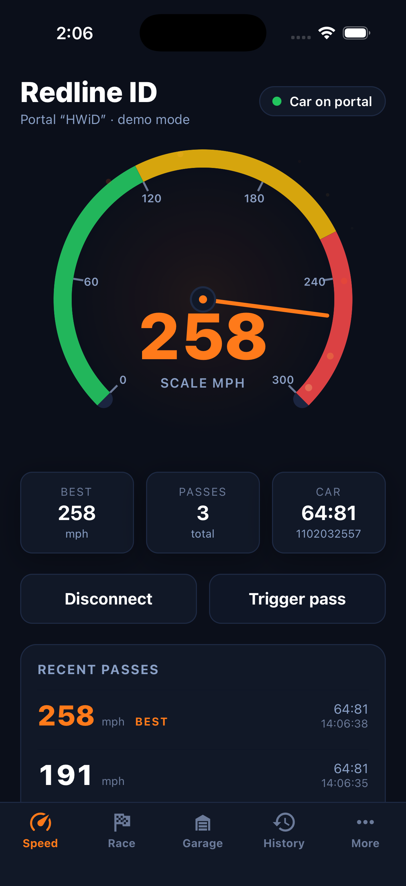
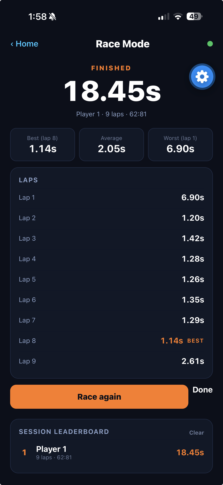

# Redline ID 🏎️

[](apps/mobile/)
[](apps/mobile/)
[](python/)
[](https://opensource.org/licenses/MIT)

**Bring your Hot Wheels id Race Portal back to life!**

An open-source tool to connect to the Hot Wheels id Race Portal after Mattel discontinued the official app on January 1, 2024. We reverse-engineered the Bluetooth protocol so you can track speeds, lap times, and build your car collection again.

> _**Redline ID** is an independent, community project and is **not affiliated with,
> endorsed by, or sponsored by Mattel, Inc.** "Hot Wheels" and "Hot Wheels id" are
> trademarks of Mattel, Inc., used here only to describe the discontinued hardware this
> tool works with._

> **Redline ID** is a fork of [`mtxmiller/hotwheels-portal`](https://github.com/mtxmiller/hotwheels-portal)
> that has grown into **two ways to bring your portal back to life**:
>
> - 📱 **A native iOS app** (React Native + Expo) — a polished speedometer, a lap-timing
>   **Race Mode**, and a live BLE event log, running on a real iPhone. **[Jump to the iOS app ↓](#ios-app)**
> - 🖥️ **The original Python terminal tools** (the reference implementation) — live dashboard,
>   lap race game, and the reverse-engineering toolkit. **[Jump to the terminal tools ↓](#what-it-does)**
>
> 📐 **Building on it?** See the
> [Architecture Overview](docs/architecture/README.md) ·
> [Decision Records (ADRs)](docs/adr/) ·
> [Roadmap](docs/ROADMAP.md) ·
> [BLE & Protocol port](docs/architecture/ble-and-protocol.md).
> The reverse-engineered BLE protocol is in [PROTOCOL.md](PROTOCOL.md).

<a id="ios-app"></a>

## 📱 iOS App

The Hot Wheels id portal, reborn as a native iPhone app. Connect over Bluetooth and watch real
speeds fly across a custom speedometer, then jump into **Race Mode** to time laps and battle for
the top of the leaderboard.

<table>
  <tr>
    <td align="center" width="50%">
      <br>
      <strong>Live speedometer</strong><br>
      Real BLE passes drive the needle, with best speed, pass count, and a recent-pass log.
    </td>
    <td align="center" width="50%">
      <br>
      <strong>🏁 Race Mode</strong><br>
      Per-lap splits, best / average / worst, and a session leaderboard.
    </td>
  </tr>
</table>

<sub>Running as a development build on a physical iPhone.</sub>

**Three screens:**

- **Speedometer (home)** — Connect to a real portal over Bluetooth and the gauge tracks every
  pass live in scale mph, keeping your best speed and recent passes. A **Live BLE / Demo** toggle
  shows off the full experience with simulated passes when no portal is around (great for the
  Simulator, the web preview, or a firmware-locked portal).
- **🏁 Race Mode** — Pick a race length (5 / 10 / 15 / 20 laps), enter a player name, and a 3·2·1
  countdown arms the race. Each car pass closes a lap; you get a live lap clock, last/best lap,
  then a full results breakdown and a session leaderboard. It's a faithful port of the terminal
  [`race_mode.py`](python/race_mode.py).
- **Live portal** — A raw, decoded BLE event log (parity with the Python `monitor.py`) for
  proving hardware and debugging the protocol.

Under the hood it speaks **both portal firmwares** — the legacy open control service and the
modern, encrypted **MPID** protocol (ECDH key exchange) — through the shared
[`@redlineid/protocol`](packages/protocol/) TypeScript port.

### Run it on your iPhone

Expo Go can't load this app (it ships a native BLE module), so you need a **development build**.
On a Mac with Xcode the fastest, no-cost path is:

```bash
cd apps/mobile
npx expo run:ios --device     # local dev build on a free Apple ID, installs on the phone
```

Then tap **Connect portal**, power on the portal, and roll a car through the gate. No hardware?
Flip the home screen to **Demo**, or run `npx expo start --web`, to explore the UI with simulated
passes. The full runbook — EAS cloud builds, the Simulator profile, and signing notes — is in
**[docs/guides/ios-dev-build.md](docs/guides/ios-dev-build.md)**.

> 👨‍👩‍👧 **Handing the iPad to kids?** Lock it to just this app with iOS **Guided Access**. There's
> one Bluetooth quirk to set up first (otherwise the speedometer can go dead and iOS may refuse to
> start Guided Access) — the one-minute fix is in the
> **[Guided Access / kiosk guide](docs/guides/ios-guided-access.md)**.

## Protocol Documentation

We've fully reverse-engineered the BLE protocol! See [PROTOCOL.md](PROTOCOL.md) for details.

**Key discoveries:**
- Device advertises as `HWiD`
- 3 BLE services for auth, data transfer, and control
- Car detection via NFC UID (6 bytes)
- Speed data as IEEE 754 float32
- Full NDEF records with Mattel car IDs

### Two firmware protocols

There are **two** transports in the wild, and which one your portal speaks
depends on its firmware:

- **Legacy** (`PROTOCOL.md`, fw ~1.2.5): the `…-000c` "Portal Control" service
  exposes the car/speed/serial characteristics **openly**, no authentication.
  The classic tools (`monitor.py`, `dashboard.py`) read these directly.
- **Modern / MPID** (`PROTOCOL_NEW.md`, e.g. fw 1.0.9): there is **no `…-000c`
  service**. The same telemetry is delivered as an **encrypted Protocol Buffers
  stream** after an **ECDH (P-256) key exchange** on the auth service. Crucially,
  the portal authenticates *itself* to the app but **does not authenticate the
  client**, so **no Mattel secret is needed** — everything required is in the
  136-byte factory token the portal hands out. Implemented in
  [`hwportal/mpid.py`](python/hwportal/mpid.py); run it with `mpid_monitor.py`.

> The modern-protocol reverse-engineering, [`PROTOCOL_NEW.md`](python/PROTOCOL_NEW.md),
> [`HWiD.proto`](python/HWiD.proto), `hwportal/mpid.py`, and the `tools/` RE scripts
> are the work of **Mitch Capper ([@mitchcapper](https://github.com/mitchcapper))**
> ([modern_protocol_support branch](https://github.com/mitchcapper/hotwheels-portal/tree/modern_protocol_support),
> MIT), vendored here with attribution. Offline correctness is re-verified in this
> repo via `python/tools/test_mpid.py`.

## Project Structure

```
HotWheelsID/
├── apps/
│   └── mobile/             # iOS app (Expo/React Native): speedometer, Race Mode, live BLE log
├── packages/
│   └── protocol/           # @redlineid/protocol — shared TS BLE protocol port (+ tests)
├── python/                 # Original Python reference tools (documented above)
│   ├── hwportal/           #   Library: constants.py (BLE UUIDs), portal.py (client)
│   │   └── mpid.py         #   Modern-firmware MPID transport (ECDH + AES-CTR + protobuf)
│   ├── dashboard.py        #   Live terminal dashboard
│   ├── race_mode.py        #   Lap race game
│   ├── portal_app.py       #   Event monitor
│   ├── scanner.py          #   BLE scanner
│   ├── monitor.py          #   Raw event monitor (legacy …-000c firmware)
│   ├── mpid_monitor.py     #   Live monitor for modern (MPID) firmware
│   ├── diag_portal.py      #   GATT diagnostic (control-service / auth-gate verdict)
│   ├── HWiD.proto          #   Protobuf schema for the modern application layer
│   ├── PROTOCOL_NEW.md     #   Modern (MPID) protocol spec
│   ├── tools/              #   RE tooling + offline test suite (test_mpid.py)
│   └── requirements.txt
├── docs/                   # Architecture notes, ADRs, and the roadmap
├── PROTOCOL.md             # Canonical reverse-engineered BLE protocol (legacy firmware)
├── package.json            # npm workspaces root
└── tsconfig.base.json      # Shared TypeScript config
```

## Monorepo & app development

The TypeScript side uses **npm workspaces** (Node 20+). From the repo root:

```bash
npm install              # install every workspace (apps/* and packages/*)
npm run typecheck        # typecheck all workspaces (protocol + mobile)
npm test                 # run all workspace tests
npm run test:protocol    # just the @redlineid/protocol unit tests
```

### Shared protocol package

[`packages/protocol`](packages/protocol/) (`@redlineid/protocol`) is a pure
TypeScript port of the BLE protocol — UUIDs, typed events, and byte decoders —
with no React Native or UI dependencies. It is unit-tested against the sample
vectors in [PROTOCOL.md](PROTOCOL.md).

### Mobile app

[`apps/mobile`](apps/mobile/) is the Expo (Expo Router) app — see **[📱 iOS App](#ios-app)**
above for the screen-by-screen tour and how to run it on a device. It has three screens
(`index` speedometer, `race` Race Mode, `live` raw event log) and decodes both portal firmwares
through [`@redlineid/protocol`](packages/protocol/).

**Preview in a browser** (no device or Xcode needed — fastest way to see the UI):

```bash
cd apps/mobile && npx expo start --web
```

The home screen auto-runs simulated passes in demo mode, so the gauge animates with zero
hardware. Real Bluetooth needs a development build on a **physical iPhone** (`npx expo run:ios
--device`); the **Live portal** screen shows a clear notice on web/the Simulator (no BLE radio
there). The full runbook — EAS cloud builds, the Simulator profile, and signing notes — is in
**[docs/guides/ios-dev-build.md](docs/guides/ios-dev-build.md)** (EAS profiles live in
[`apps/mobile/eas.json`](apps/mobile/eas.json)). See also
[ADR-0011](docs/adr/0011-phase-1-ble-transport.md). To put the app in family/friends' hands
over **TestFlight**, follow the
**[iOS TestFlight & distribution runbook](docs/guides/ios-testflight.md)**.

## Roadmap

The full, phased plan toward the attractive UI and the installable iOS app lives in
**[docs/ROADMAP.md](docs/ROADMAP.md)**. Status of the original Python tooling:

- [x] BLE connection and event monitoring
- [x] Car detection (NFC UID, serial)
- [x] Speed tracking
- [x] Live dashboard with speedometer
- [x] Lap race game mode with leaderboard
- [x] Persistent car database
- [x] Car collection/garage view
- [x] Achievement system
- [ ] Car identity enrichment from Mattel ID / catalog data (in progress)

The iOS app is **already running on-device** — a live BLE speedometer, **Race Mode**, and a raw
event log (see [📱 iOS App](#ios-app)). It is also **installed through TestFlight** and has been
used to run a full race end-to-end. The remaining work is tracked in the
[Roadmap](docs/ROADMAP.md) and [ADRs](docs/adr/), with current focus on richer car identity and
other Phase 5 depth work; Android parity is explicitly backlogged until test hardware exists.

## Contributing

We'd love your help! Here's how:

1. **Got a Portal?** Run the tools and share interesting findings
2. **Know BLE/NFC?** Help decode remaining protocol mysteries
3. **Want features?** Check the issues and submit PRs

## Why This Exists

Mattel discontinued the Hot Wheels id app on January 1, 2024, leaving thousands of Race Portals as paperweights. This project aims to restore functionality through reverse engineering, letting Hot Wheels fans continue to enjoy their hardware.  This fork is because my children wanted an ipad app.  Also the Portal firmware is different on our device and required significant work to decrypt beyond the original project.

## Support the Project

If this project helped bring your Hot Wheels Portal back to life, consider supporting development:

- ⭐ **Star this repository**
- 🐛 **Report issues** and suggest features

### PayPal Donations

[Donate with Paypal!](https://www.paypal.com/donate/?business=DAABJ7R4P22CC&no_recurring=0&currency_code=USD)

## License

MIT License - see [LICENSE](LICENSE) for details.

## Disclaimer

This project is not affiliated with Mattel or Hot Wheels. It's a community effort to restore functionality to discontinued hardware. Hot Wheels is a trademark of Mattel, Inc.

## Resources

- [Hot Wheels id Wiki](https://hotwheels.fandom.com/wiki/Hot_Wheels_id)
- [Bleak BLE Library](https://github.com/hbldh/bleak)
- [Rich Terminal Library](https://github.com/Textualize/rich)
