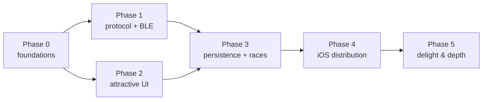

# HotWheelsID Roadmap

From a Python terminal tool to a polished, cross-platform app **installable on iOS**.

This roadmap is organized into phases with clear **exit criteria**. It assumes the
direction set in the [ADRs](adr/) (React Native + Expo, shared TS protocol package, BLE via
`react-native-ble-plx`). Architecture detail lives in [`docs/architecture/`](architecture/).

**Legend:** ✅ done · 🔜 next · ⬜ planned

---

## Phase 0 — Foundations & repo setup 🔜

Set up the monorepo and tooling so app work can begin. No hardware needed.

- ⬜ Restructure to the monorepo layout from [ADR-0007](adr/0007-monorepo-structure-and-python-reference.md):
  move Python into `python/`, add `apps/` and `packages/` (JS workspaces).
- ⬜ Scaffold `packages/protocol` (`@redlineid/protocol`) with `uuids.ts` ported from
  `python/hwportal/constants.py` and stub `events.ts` / `decode.ts`.
- ⬜ Scaffold `apps/mobile` with Expo (TypeScript, Expo Router) + `expo-dev-client`.
- ⬜ Add CI: typecheck + unit tests for the protocol package.
- ⬜ Update README with monorepo dev instructions.

**Exit criteria:** `apps/mobile` runs in the iOS Simulator (placeholder screen);
`packages/protocol` builds and is imported by the app; CI green.

---

## Phase 1 — Protocol port + first BLE connection 🟡

Make the app actually talk to the portal.

- ✅ Implement `parseCharacteristicValue` + decoders in `@redlineid/protocol`
  (car detected/removed, speed, serial; control status). See
  [BLE & Protocol](architecture/ble-and-protocol.md).
- ✅ **Unit tests** against the sample vectors in `PROTOCOL.md` (UID, speed floats, control)
  — now also covering the Base64 wire path (`bytesFromBase64` → parser).
- ✅ Add the `react-native-ble-plx` config plugin; produce a **custom dev build**
  ([ADR-0003](adr/0003-bluetooth-with-react-native-ble-plx.md)).
- ✅ BLE service: scan by name `HWiD` (+ `SERVICE_CONTROL`), connect, subscribe, base64→bytes,
  dispatch parsed events into the Zustand store (`apps/mobile/src/ble/`,
  [ADR-0011](adr/0011-phase-1-ble-transport.md)).
- ✅ Minimal **Live portal** screen + raw event log (parity with `monitor.py`/`scanner.py`).
- ✅ Handle permissions, Bluetooth-off, and disconnect/reconnect (with backoff).
- ⬜ **Verify on a physical iPhone** (the only place BLE can run — not web/simulator).
- ⛔ **Blocked on this portal:** the user's unit runs **gated firmware** that exposes only
  Service A (auth) + Service B (data) — **Service C (control), which holds every car/speed/serial
  characteristic, is hidden behind the unsolved Service-A auth handshake**. Confirmed independently
  from a fresh desktop central via `python/diag_portal.py` (so it is the portal, not an iOS cache).
  The original tooling worked because it targeted **firmware 1.2.5**, which exposed all 3 services
  freely. The app now detects this and surfaces a clear **"Portal locked"** state instead of a
  silent dead connection. Live car/speed therefore needs either the auth handshake (see below) or a
  1.2.5-era portal.

**Exit criteria:** On a physical iPhone, placing a car shows car detection + live speed
values flowing through the parsed event pipeline. *(Code complete + web/simulator-verified.
On-device: BLE connect/discovery verified; live events **blocked** by the portal's firmware
auth-gate on Service C — see the auth-handshake known-unknown in
[BLE & Protocol §6](architecture/ble-and-protocol.md) and Phase 5 below.)*

---

## Phase 2 — Attractive UI (the headline goal) ⬜

Build the polished experience, developing against mocked events in parallel with Phase 1.

- ⬜ Design tokens + base components ([UI & Design](architecture/ui-and-design.md)).
- ⬜ **Skia speedometer gauge** with Reanimated needle, speed zones, digital readout.
- ⬜ High-speed flame/particle effect + haptics on detect/record.
- ⬜ Speedometer screen: current car, recent passes, best speed/lap.
- ⬜ Mock event generator for hardware-free UI iteration; respect "reduce motion".
- ⬜ App theming, icon, splash.

**Exit criteria:** The live speedometer looks and feels great on device and in the
Simulator; a non-technical family member can understand it at a glance.

---

## Phase 3 — Persistence: garage, history, races ⬜

Fix the upstream "no persistent storage" gap and bring races across.

- ⬜ `expo-sqlite` schema (cars, sessions, passes, races, results) +
  settings via MMKV ([ADR-0006](adr/0006-state-management-and-persistence.md)).
- ⬜ **Garage**: car collection with per-car best speed/lap; car detail screen.
- ⬜ **Race mode** port of `race_mode.py` (5/10/15/20 laps, countdown, results) + local
  **leaderboard**.
- ⬜ **History**: past sessions and passes.
- ⬜ Car-name lookup from the Mattel NDEF id (best-effort; see known unknowns).

**Exit criteria:** Cars, bests, and race results survive app restarts; race mode is fully
playable with a saved leaderboard.

---

## Phase 4 — iOS distribution ⬜

Make it genuinely installable for the family.

- ⬜ `eas.json` with `development` / `preview` / `production` profiles
  ([ADR-0008](adr/0008-ios-distribution-with-eas-and-testflight.md)).
- ⬜ Enroll in the Apple Developer Program; configure signing.
- ⬜ Ship a **TestFlight** build to the developer + a few testers.
- ⬜ (Free-ID 7-day dev build documented as the no-cost stop-gap.)
- ⬜ Android `preview` build for parity.

**Exit criteria:** A tester installs HotWheelsID on their iPhone via TestFlight and runs a
race end-to-end.

---

## Phase 5 — Delight & depth (backlog) ⬜

Pulls in the upstream roadmap's "future features" and more.

- ⬜ Achievements (top speed, lap streaks, collection milestones).
- ⬜ Richer car identity: art, model names, rarity from the Mattel id.
- ⬜ Multiplayer/turn-based race nights; share results.
- ⬜ Sound design; optional "TV/host mode."
- ⬜ Calibrate speed to real-world units.
- ⬜ Decode remaining protocol unknowns (auth handshake, full NDEF schema). **Now load-bearing:**
  on **gated firmware** the Service-A challenge-response (read 148-byte cert at `0003-000a`, respond
  on `0002-000a`/`0004-000a`) is what unlocks **Service C** (all car/speed data). `python/diag_portal.py`
  is the desktop lab bench for probing it. No public solution exists (Mattel backend, discontinued 2024).

---

## Cross-cutting (every phase)

- **Testing:** keep `@redlineid/protocol` unit-tested; add UI tests where valuable.
- **Docs:** new significant decisions → a new ADR; keep `architecture/` current.
- **Protocol truth:** `PROTOCOL.md` stays canonical; the Python tools remain the
  hardware oracle ([ADR-0007](adr/0007-monorepo-structure-and-python-reference.md)).

## Dependency view

> Phases 1 and 2 can run **in parallel** — the UI builds against mocked events while the
> protocol/BLE pipeline comes online, then they meet at Phase 3.
