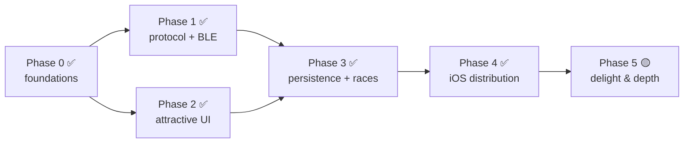

# HotWheelsID Roadmap

From a Python terminal tool to a polished, cross-platform app **installable on iOS**.

This roadmap is organized into phases with clear **exit criteria**. It assumes the
direction set in the [ADRs](adr/) (React Native + Expo, shared TS protocol package, BLE via
`react-native-ble-plx`). Architecture detail lives in [`docs/architecture/`](architecture/).

**Legend:** ✅ done · 🟡 in progress · 🔜 next · ⬜ planned

---

## Status at a glance (updated 2026-07-09)

| Phase | Status | Notes |
|---|---|---|
| 0 — Foundations & repo setup | ✅ Done | Monorepo, `@redlineid/protocol`, Expo app, CI all in place. |
| 1 — Protocol port + first BLE connection | ✅ Done | **Live car + speed hardware-validated on iPhone.** The modern-firmware auth gate is decoded (PR #9, [ADR-0012](adr/0012-modern-mpid-protocol-and-transport.md)). |
| 2 — Attractive UI | ✅ Done | Skia speedometer, flames, haptics, reduce-motion, mock generator, recent passes. |
| 3 — Persistence: garage, history, races | ✅ Done | **Race Mode, Garage, History, and Settings all durable** on a shared `expo-sqlite` db (PRs #15/#16/#18/#19). Restart-safe and device-validated. |
| 4 — iOS distribution | ✅ Done | Installed through TestFlight and race-validated end-to-end on iPhone. |
| 5 — Delight & depth | 🟡 In progress | Achievements shipped; richer car identity, initial race-night lineup, and race sound cues shipped; "TV/host mode" and advanced multiplayer remain. |

> The headline goal — a polished, hardware-validated live speedometer on iOS — is **achieved**.
> The app is now **installed through TestFlight and race-validated end-to-end on iPhone**,
> and the focus has moved to **Phase 5 — Delight & depth**, especially richer car identity and race-night depth.

---

## Phase 0 — Foundations & repo setup ✅

Set up the monorepo and tooling so app work can begin. No hardware needed.

- ✅ Restructure to the monorepo layout from [ADR-0007](adr/0007-monorepo-structure-and-python-reference.md):
  move Python into `python/`, add `apps/` and `packages/` (JS workspaces).
- ✅ Scaffold `packages/protocol` (`@redlineid/protocol`) with `uuids.ts` ported from
  `python/hwportal/constants.py` and `events.ts` / `decode.ts`.
- ✅ Scaffold `apps/mobile` with Expo (TypeScript, Expo Router) + `expo-dev-client`.
- ✅ Add CI: typecheck + unit tests (`.github/workflows/ci.yml`).
- ✅ Update README with monorepo dev instructions.

**Exit criteria:** ✅ `apps/mobile` runs; `packages/protocol` builds and is imported by the
app; CI green.

---

## Phase 1 — Protocol port + first BLE connection ✅

Make the app actually talk to the portal.

- ✅ Implement `parseCharacteristicValue` + decoders in `@redlineid/protocol`
  (car detected/removed, speed, serial; control status). See
  [BLE & Protocol](architecture/ble-and-protocol.md).
- ✅ **Unit tests** against the sample vectors in `PROTOCOL.md` (UID, speed floats, control)
  — now also covering the Base64 wire path (`bytesFromBase64` → parser).
- ✅ Add the `react-native-ble-plx` config plugin; produce a **custom dev build**
  ([ADR-0003](adr/0003-bluetooth-with-react-native-ble-plx.md)).
- ✅ BLE service: scan by name `HWiD` (+ `SERVICE_CONTROL`), connect, subscribe, base64→bytes,
  dispatch parsed events into the Zustand store (`apps/mobile/src/ble/`,
  [ADR-0011](adr/0011-phase-1-ble-transport.md)).
- ✅ Minimal **Live portal** screen + raw event log (parity with `monitor.py`/`scanner.py`).
- ✅ Handle permissions, Bluetooth-off, and disconnect/reconnect (with backoff).
- ✅ **Verified on a physical iPhone** ("Hyperion V", iOS 26.5.1): placing a car shows live
  detection + speed on the Home gauge, and the Live screen streams decoded telemetry.
- ✅ **Modern-firmware unlock (was the blocker):** the user's portal runs **modern firmware
  (1.0.9)** that exposes **no** legacy control service — telemetry is encrypted protobuf over
  the **auth service** after a P-256 ECDH handshake (AES-128-CTR, CRC-8). The portal
  authenticates *itself* (anti-counterfeit), so the client only sends an ephemeral pubkey and
  the stream is decodable offline with **no Mattel secret or backend**. Ported to TS in
  `packages/protocol/src/mpid/` and driven over BLE by `apps/mobile/src/ble/mpidBle.ts`; the
  transport auto-detects **legacy → MPID → locked** (PR #9,
  [ADR-0012](adr/0012-modern-mpid-protocol-and-transport.md); RE credit @mitchcapper). A
  genuinely locked unit (neither path available) still surfaces a clear **"Portal locked"** state.

**Exit criteria:** ✅ **Met.** On a physical iPhone, placing a car shows car detection + live
speed flowing through the parsed event pipeline — on this modern-firmware portal via the MPID
transport.

---

## Phase 2 — Attractive UI (the headline goal) ✅

Build the polished experience, developing against mocked events in parallel with Phase 1.

- ✅ Design tokens + base components ([UI & Design](architecture/ui-and-design.md)).
- ✅ **Skia speedometer gauge** with Reanimated needle, speed zones, digital readout
  (`components/gauge/Speedometer.tsx`, `geometry.ts`).
- ✅ High-speed flame/particle effect + haptics on detect/record (`components/gauge/FlameField.tsx`).
- ✅ Speedometer screen: current car, recent passes, best speed/lap (`app/index.tsx`,
  `components/RecentPasses.tsx`).
- ✅ Mock event generator for hardware-free UI iteration; respects "reduce motion"
  (`mock/mockPortal.ts`).
- ✅ App theming, icon, splash.

**Exit criteria:** ✅ The live speedometer looks and feels great on device and in the
Simulator; understandable at a glance.

---

## Phase 3 — Persistence: garage, history, races ✅

Fix the upstream "no persistent storage" gap and bring races across.

- ✅ `expo-sqlite` schema (cars, sessions, passes, races, results) on a single shared
  `redlineid.db` with a versioned migration ladder (`store/persistence/sqliteDb.ts`),
  loaded behind a native-module probe so a missing build degrades gracefully instead of
  red-screening ([ADR-0006](adr/0006-state-management-and-persistence.md)).
- ✅ **Garage**: car collection with per-car best speed/lap + car detail screen
  (PR #16) — auto-populated as cars are detected on the portal.
- ✅ **Race mode** port of `race_mode.py` (5/10/15/20 laps, countdown, results) + on-screen
  **leaderboard** (`app/race.tsx` / `race/raceEngine.ts` / `store/raceStore.ts`). The
  leaderboard is now **durable** — race results persist across restarts (PR #15).
- ✅ **History**: past sessions and passes, browsable with a detail view (PR #19).
- ✅ **Settings**: durable app preferences — player name, default laps, haptics,
  reduce-motion, demo-mode default (PR #18). Landed as a `settings` KV table on the **same
  SQLite db** rather than MMKV (ADR-0006's original pick): no native rebuild, fully
  Node-testable; MMKV stays a clean swap-in if a synchronous pre-paint read is ever needed.
- ⬜ Car-name lookup from the Mattel NDEF id (best-effort; see Phase 5 / known unknowns).

**Exit criteria:** ✅ **Met.** Cars, bests, race results, history, and settings all survive
app restarts; race mode is fully playable with a saved leaderboard. *(Car-name lookup is the
one open best-effort item, tracked under Phase 5.)*

---

## Phase 4 — iOS distribution ✅

Make it genuinely installable for the family.

- ✅ `eas.json` with `development` / `preview` / `production` profiles
  ([ADR-0008](adr/0008-ios-distribution-with-eas-and-testflight.md)).
- ✅ Enroll in the Apple Developer Program; configure signing.
- ✅ Ship a **TestFlight** build to the developer + testers.
- ✅ (Free-ID 7-day dev build documented as the no-cost stop-gap.)
- ⬜ Android `preview` build for parity — **shelved to backlog** until Android test hardware is
  available.

**Exit criteria:** ✅ **Met.** HotWheelsID has been installed on iPhone through TestFlight and
run through a race end-to-end.

---

## Phase 5 — Delight & depth 🟡

Pulls in the upstream roadmap's "future features" and more.

- ✅ Achievements (top speed, lap streaks, collection milestones) (PR #23).
- 🟡 Richer car identity: art, model names, rarity from the Mattel id. **Initial catalog flow
  shipped** — bundled Hot Wheels Fandom catalog (146 cars + photos), richer search/meta, manual
  casting picker keyed off decoded `mattelId`, and casting coverage UX in identify/garage
  (identify once, label matching copies), isolated from the garage schema (see
  [ADR-0013](adr/0013-car-identity-catalog.md)). The `mattelId` is now fully structured — model
  id + big-endian `productId` (== the portal serial) + embedded tag UID, with runtime cross-checks
  (PR #46). **Automatic identity via a crowd-sourced community seed is now shipped** — Settings
  exports confirmed `castingKey → catalog` identifications (product-number facts only, never tags
  or collection), a bundled seed merges at bootstrap so scanned cars auto-name with zero taps, and
  the user's own pick always wins over the seed (see
  [ADR-0014](adr/0014-crowd-sourced-car-identity-seed.md)). Contributions are managed **as a repo**
  ([`community/`](../community/README.md)): the app's Share button emits a payload, a PR adds it, CI
  validates it and majority-vote aggregation (`python/tools/build_seed.py`) regenerates the bundled
  seed — no hosted service, no runtime network. The seed ships empty at cold start and grows as
  contributions pool.
- 🟡 Multiplayer/turn-based race nights. **Initial race-night lineup shipped** — queue racers,
  choose who is up next, rotate turns after each heat. Next slice is per-lineup car assignment and
  deeper multi-racer race semantics.
- ✅ Share race & session results to the native share sheet (PR #26).
- 🟡 Sound design; optional "TV/host mode." **Race sound cues shipped** — countdown ticks/go,
  per-lap and new-best chirps, and a finish triad, gated by a new **Sound** setting and mirroring
  the haptics seam. Cues are original procedural tones generated by `python/tools/gen_sound_cues.py`
  (no third-party audio), played through `expo-audio` and degrading to silence until a native
  rebuild. "TV/host mode" remains.
- ✅ Speed units (mph / km/h) + display calibration to real-world speeds (PR #25).
- ⬜ Android `preview` build / parity. **Backlogged** until there is an Android device available
  for real testing.
- 🟡 Decode remaining protocol unknowns. The **live-telemetry gate is solved** on modern
  firmware (the encrypted auth-service stream is fully decoded — see Phase 1 / ADR-0012). Car
  **identity decoding is now solved too**: the `mattelId` structure (version / `productId` /
  tag UID) is reverse-engineered and independently corroborated, and the product number is
  recoverable offline from the tag alone (PR #46). What remains is only the **product-number → name**
  map. Reviving the Mattel backend and scraping archived responses were both investigated and are
  **dead ends** (host discontinued end of 2023 and now redirects to a FAQ; zero `pid.mattel` captures
  in the Wayback index). The chosen path is the crowd-sourced community seed
  ([ADR-0014](adr/0014-crowd-sourced-car-identity-seed.md)). The Python tools +
  `python/diag_portal.py` stay the desktop lab bench.

---

## Cross-cutting (every phase)

- **Testing:** keep `@redlineid/protocol` unit-tested; add UI tests where valuable.
- **Docs:** new significant decisions → a new ADR; keep `architecture/` current.
- **Protocol truth:** `PROTOCOL.md` stays canonical; the Python tools remain the
  hardware oracle ([ADR-0007](adr/0007-monorepo-structure-and-python-reference.md)).

## Dependency view

> Phases 1 and 2 can run **in parallel** — the UI builds against mocked events while the
> protocol/BLE pipeline comes online, then they meet at Phase 3.
