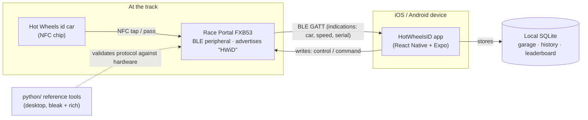
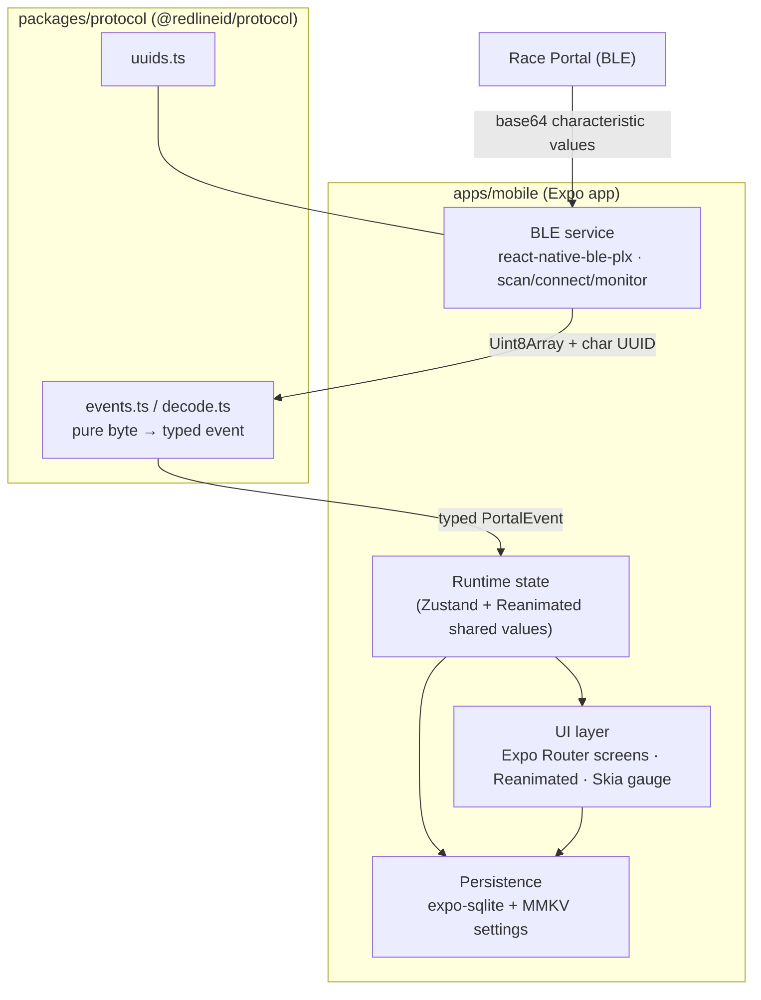
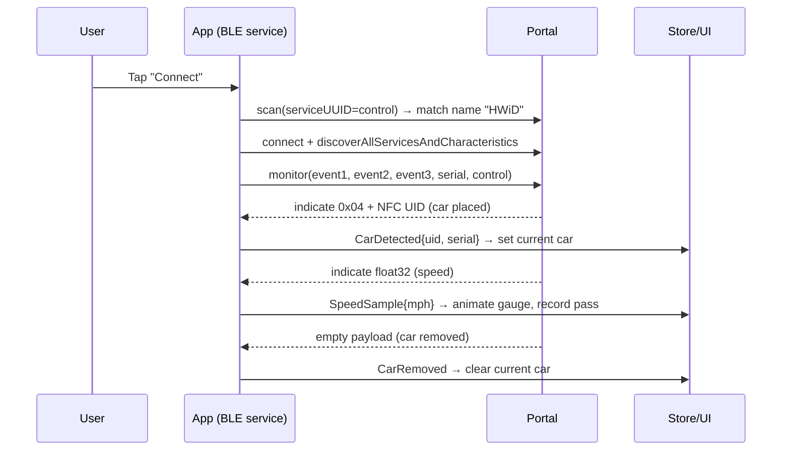

# HotWheelsID — Architecture Overview

This document describes the **target architecture** for HotWheelsID: a cross-platform
React Native (Expo) app, installable on iOS, that talks to the Hot Wheels id Race Portal
over BLE. For the *why* behind these choices, see the [ADRs](../adr/). For the byte-level
protocol, see [`PROTOCOL.md`](../../PROTOCOL.md) and [BLE & Protocol](ble-and-protocol.md).

> **Status:** planning. The Python tools exist today; the mobile app and shared protocol
> package are being scaffolded per the [Roadmap](../ROADMAP.md).

## 1. Goals & constraints

- **Attractive, animated UI** (live speedometer, races, garage, history).
- **Installable on iOS** (and Android, for free).
- **Hard constraint:** Python/`bleak` can't run on iOS, and iOS Safari has no Web
  Bluetooth. The only portable asset is the protocol spec → re-implement BLE natively via
  React Native. (See [ADR-0002](../adr/0002-adopt-react-native-and-expo.md).)

## 2. System context



## 3. Container / module view



**Layer responsibilities**

| Layer | Package | Responsibility | Key deps |
|-------|---------|----------------|----------|
| UI | `apps/mobile` | Screens, navigation, animated gauge, theming | Expo Router, Reanimated, Skia, expo-image |
| Runtime state | `apps/mobile` | Connection/car/race state; dispatch parsed events | Zustand |
| BLE transport | `apps/mobile` | Scan, connect, subscribe, base64⇄bytes, reconnect | react-native-ble-plx |
| Protocol | `packages/protocol` | UUIDs + pure parsers (no RN/UI deps) | — (plain TS) |
| Persistence | `apps/mobile` | Cars, sessions, passes, races, leaderboard | expo-sqlite, react-native-mmkv |
| Reference | `python/` | Hardware validation & desktop utility | bleak, rich |

## 4. Tech stack (target)

| Concern | Choice | ADR |
|--------|--------|-----|
| App framework | React Native + Expo (TypeScript) | [0002](../adr/0002-adopt-react-native-and-expo.md) |
| Navigation | Expo Router | [0005](../adr/0005-ui-stack-reanimated-skia-expo-router.md) |
| Animation | react-native-reanimated | [0005](../adr/0005-ui-stack-reanimated-skia-expo-router.md) |
| Custom graphics (gauge) | @shopify/react-native-skia | [0005](../adr/0005-ui-stack-reanimated-skia-expo-router.md) |
| Bluetooth | react-native-ble-plx + expo-dev-client | [0003](../adr/0003-bluetooth-with-react-native-ble-plx.md) |
| Protocol | `@redlineid/protocol` (shared TS) | [0004](../adr/0004-shared-typescript-protocol-package.md) |
| Runtime state | Zustand | [0006](../adr/0006-state-management-and-persistence.md) |
| Durable storage | expo-sqlite (+ MMKV settings) | [0006](../adr/0006-state-management-and-persistence.md) |
| Build & distribution | EAS Build → dev client / TestFlight | [0008](../adr/0008-ios-distribution-with-eas-and-testflight.md) |
| Reference impl | Python (bleak + rich) | [0007](../adr/0007-monorepo-structure-and-python-reference.md) |

## 5. Repository layout (target)

```
HotWheelsID/
├── apps/mobile/            # Expo app (the product)
├── packages/protocol/      # @redlineid/protocol — TS protocol port
├── python/                 # existing Python reference tools (moved in Phase 0)
├── docs/
│   ├── adr/                # architecture decision records
│   ├── architecture/       # this overview + BLE/protocol + UI design
│   └── ROADMAP.md
├── PROTOCOL.md             # canonical protocol spec
└── README.md
```

See [ADR-0007](../adr/0007-monorepo-structure-and-python-reference.md) for the rationale
and the migration note (Python relocates from the repo root in Phase 0).

## 6. Key runtime flows

**Connect → monitor (happy path)**



See [BLE & Protocol](ble-and-protocol.md) for the byte formats, the Python→TS mapping,
and iOS-specific BLE behavior (no MAC address, base64 values, permissions).

## 7. Cross-cutting concerns

- **Permissions:** iOS `NSBluetoothAlwaysUsageDescription`; Android `BLUETOOTH_SCAN`/
  `BLUETOOTH_CONNECT`. Handle "Bluetooth off" and denied-permission states gracefully.
- **Resilience:** scan timeouts, auto-reconnect to the last-known portal UUID, and a clear
  connection-state machine surfaced in the UI.
- **Testability:** protocol package unit-tested against `PROTOCOL.md` sample vectors; UI
  buildable against mocked events with no hardware.
- **Units:** speed is `float32 × 64` ("scale mph") per the spec; treat as relative until
  calibrated, and keep the raw value for re-interpretation.
- **Privacy/offline:** fully local; no accounts or network required for core play.
