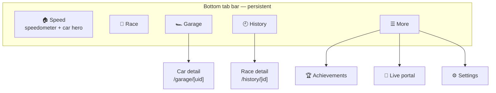

# Redline ID — Design Language

The canonical reference for **how Redline ID looks and feels** — the visual and interaction
system every screen should follow. It complements [`ui-and-design.md`](ui-and-design.md)
(screen intent + component plan) and is grounded in the live tokens in
[`apps/mobile/src/theme/tokens.ts`](../../apps/mobile/src/theme/tokens.ts).

> **Living document.** When a token or pattern changes in code, update it here too. Where a
> choice is architectural (e.g. the navigation model), it should also be backed by an
> [ADR](../adr/). The current navigation/home/connection direction is tracked in the
> redesign epic (**#28**).

---

## 1. Personality & principles

Redline ID should feel like an **arcade racing toy brought to life** — bold, fast, and
legible from across a play mat, friendly to kids but not childish.

- **The speedometer is the hero.** When a car passes, the gauge feels *alive* (needle snap,
  glow, flames at high speed). Everything else is in service of that moment.
- **Glanceable state.** Connection, current car, and last speed are always obvious.
- **Big, bold, high-contrast.** Large numbers, chunky cards, confident accent color.
- **Offline-first, no accounts.** Everything works on-device; the only setup is the portal.
- **It should just work.** Prefer automatic behavior (auto-connect) over buttons the user
  must hunt for.

> **Trademark note:** Redline ID is an unofficial, **Mattel-unaffiliated** project (see the
> README disclaimer). Evoke a racing aesthetic — do **not** copy Hot Wheels logos or brand
> assets.

---

## 2. Color

Dark "night-track" foundation, a flame-orange primary accent, an electric-blue secondary,
and a semantic green→yellow→red speed scale. All values are the source-of-truth tokens from
`theme/tokens.ts`.

### Surfaces & structure

| Token | Hex | Use |
|-------|-----|-----|
| `bg` | `#0b0f1a` | App background — deep night track |
| `surface` | `#111827` | Raised card / panel |
| `surfaceAlt` | `#0f1626` | Nested rows, ghost buttons, segmented controls |
| `border` | `#1e2a44` | Hairline borders on cards |
| `track` | `#1b2540` | Unfilled gauge arc |

### Text

| Token | Hex | Use |
|-------|-----|-----|
| `textPrimary` | `#ffffff` | Headlines, values, primary labels |
| `textSecondary` | `#8aa0c6` | Subtitles, supporting copy |
| `textMuted` | `#6b7a99` | Captions, units, disabled/idle |

### Accents

| Token | Hex | Use |
|-------|-----|-----|
| `accent` | `#ff7a1a` | **Primary** — flame orange. Needle, primary buttons, active tab, key emphasis |
| `accentBlue` | `#26c6ff` | **Secondary** — electric blue. Links/secondary actions, info accents |

### Semantic & speed zones

| Token | Hex | Use |
|-------|-----|-----|
| `zoneGreen` / `ok` | `#22c55e` | Slow band · success/connected |
| `zoneYellow` / `warn` | `#eab308` | Mid band · caution |
| `zoneRed` / `danger` | `#ef4444` | Fast band · error/destructive |
| `idle` | `#6b7a99` | Disconnected / neutral |

**Usage rules**

- One **accent** per view as the primary call-to-action; reserve **accentBlue** for
  secondary/navigational emphasis so the hierarchy stays clear.
- Never rely on color alone — pair speed zones with **position and labels** (see
  [§11 Accessibility](#11-accessibility)).
- Keep large fills on `surface`/`surfaceAlt`; accents are for edges, text, and small fills.

---

## 3. Typography

System font stack (San Francisco on iOS). Numbers are the stars — they go big and heavy.

| Token | Size | Typical use |
|-------|------|-------------|
| `display` | 64 | Speedometer readout, race countdown |
| `xl` | 28 | Screen titles |
| `lg` | 20 | Stat values, section headers |
| `md` | 16 | Body, button labels |
| `sm` | 13 | Subtitles, secondary copy |
| `xs` | 11 | Captions, units, uppercase eyebrows |

| Weight | Value | Use |
|--------|-------|-----|
| `heavy` | 800 | Titles, the speed readout |
| `bold` | 700 | Buttons, stat values, emphasis |
| `medium` | 600 | Subtle emphasis |
| `regular` | 400 | Body |

**Conventions:** uppercase + `letterSpacing: 1` for small eyebrow labels (e.g. stat
captions "BEST", "PASSES"); `numberOfLines` clamp on values so cards never reflow.

---

## 4. Spacing, radius, elevation

- **Spacing** — 4-pt base scale via `spacing(n) = n * 4`. Common rhythm: `spacing(3)` (12)
  inside cards, `spacing(5)` (20) between major blocks. Content max width **420**, centered.
- **Radius** — `sm` 8 · `md` 12 (cards, buttons) · `lg` 16 · `xl` 24 · `pill` 999
  (toggles, status pill, FAB).
- **Elevation & glow** — depth comes from `surface` + 1px `border`, not heavy shadows. Use a
  soft **accent glow** to signal "active/alive" (e.g. a new best, the connected pill, a
  hero CTA) rather than drop shadows everywhere. Reusable presets live in `theme/tokens.ts`
  as `elevation`: `card` (a subtle ambient lift so a card reads as its own object above the
  night-track bg), `accentGlow` (flame-orange "alive" halo — the on-portal car, a best-speed
  hero, a selected casting), and `blueGlow` (electric-blue, for secondary emphasis). For a
  raised/showcase surface, pair a glow with `colors.surfaceRaised`; for a soft selected fill
  use the translucent `colors.accentSoft` / `accentBlueSoft` washes.

---

## 5. Iconography

Navigation icons use **MaterialCommunityIcons** (`@expo/vector-icons`), tinted with the
theme so they pick up the active/inactive tab color. Keep a consistent vocabulary so an
icon always means the same thing:

| Icon (MaterialCommunityIcons) | Meaning |
|-------|---------|
| `speedometer` | Speed / Home |
| `flag-checkered` | Race |
| `garage` | Garage |
| `history` | History |
| `trophy` | Achievements |
| `access-point` | Live portal (raw BLE) |
| `cog` | Settings |
| `dots-horizontal` | More |

Tab-bar icons inherit their color from `tabBarActiveTintColor` (flame `accent`) /
`tabBarInactiveTintColor` (`textMuted`); the **More** list rows render in `accent`.

Emoji are still used as oversized **empty-state illustrations** (e.g. the empty Garage and
History screens) and as **achievement badges** (`src/achievements/catalog.ts`), where their
color and personality are a feature rather than a chrome icon.

---

## 6. Navigation model

**Direction (Prop A, epic #28):** a persistent **bottom tab bar** for the primary modes,
with a **More** sheet for the rest. This replaces the v1.0 home "hub" (a vertical stack of
six full-width buttons) and matches the screen map already in
[`ui-and-design.md`](ui-and-design.md) §2.

**Rules**

- **≤ 5 tabs.** Primary, frequently-used destinations only; everything else lives behind
  **More**. Adding a mode should not require touching the tab bar.
- **Active tab** uses `accent` (#ff7a1a); inactive uses `textMuted`. Tab bar sits on a
  `surface` background with a hairline top `border`, respecting the home-indicator safe area.
- **Primary modes are reachable from anywhere** — no "Back to Home" round-trips.
- **Detail screens push** over their owning tab and keep a standard back affordance.

---

## 7. Core components & patterns

Hand-rolled components (no UI library yet, per [ADR-0005](../adr/0005-ui-stack-reanimated-skia-expo-router.md)).
Reuse these patterns rather than inventing new ones.

| Component | Pattern |
|-----------|---------|
| **Speedometer** (hero) | SVG arc gauge: `track` arc, green/yellow/red zone bands, ticks, flame-orange needle that springs to each pass then eases to rest; `display`-size digital readout below. |
| **Car hero** *(new, #31)* | Identity + art slot for the last-scanned car on the Speed screen (name when known, else short UID + serial; placeholder when none). |
| **Status pill** | Pill on `surfaceAlt`/tinted bg with a state dot + label. **Becomes the connect/disconnect control** (#33) — see [§10](#10-connection-ux). |
| **Stat card** | `surface` + `border`, `radius.md`; uppercase `xs` caption, `lg`/`bold` value, `xs` unit. Used in the Speed 3-up row (Best · Passes · Last); car identity lives in the dedicated hero. |
| **Buttons** | `radius.md`, `spacing(3.5)` vertical. **Primary** = `accent` fill on `bg` text; **Secondary** = `surface` + `border`; **Ghost** = `surfaceAlt` + `border`. Pressed → `opacity 0.7`; disabled → `opacity 0.4`. |
| **Segmented toggle** | Pill container on `surfaceAlt`; active segment filled `accent` (e.g. the Live BLE / Demo switch). |
| **Mode list rows (More)** *(new, #30)* | Icon column · title · optional stat subtitle · chevron, on `surface` with hairline dividers. |
| **Banner** | Inset card with a semantic border (e.g. `danger` for "firmware unsupported") + a clear recovery action. |

---

## 8. Motion

- **Springy and snappy** via `react-native-reanimated`; target 60–120 fps
  ([ADR-0005](../adr/0005-ui-stack-reanimated-skia-expo-router.md)).
- The **needle** is the signature motion: snap to a pass, hold briefly (~1.3 s), then ease
  back toward zero.
- Use motion to celebrate **records and detections** (glow/pulse), not for chrome.
- Always provide a **reduce-motion** path (see §11).

---

## 9. Haptics

Tactile feedback reinforces real events (`expo-haptics`, gated by the **Haptics** setting):

- **Pass** → medium impact; **new record** → success notification.
- **Car detected** → light selection tick.
- **Connect/disconnect** (#33) → a clear confirming tap.

Haptics are off on web and respect the user setting.

---

## 10. Connection UX

**Principle: the app connects itself.** Bluetooth should not require hunting for a button.

- **Application-level lifecycle:** one root controller owns the active BLE/mock transport for the
  full app session. Tabs consume the same stream, so Race and Live do not depend on Speed mounting
  and opening diagnostics cannot steal the connection.
- **Auto-connect on launch** (#32): on a BLE-capable device (not demo mode), the app scans
  for `HWiD` and connects automatically. Each scan has a finite window and retries use capped,
  finite exponential backoff. Web and the Simulator stay in simulated mode and never load BLE.
- **Durable Demo choice:** selecting Demo writes the existing startup preference. A device forced
  into Demo because BLE is unavailable does not overwrite that preference.
- **The status pill is the control** (#33): tap to (re)connect/retry; disconnect via
  tap-when-connected (confirm) or long-press. This **removes** the dedicated "Connect
  portal" button.
- **Always communicate state** through the pill: `idle · scanning · connecting · authenticating ·
  connected · portal not found · error`, using semantic colors plus text.
- **Fail gracefully:** Bluetooth-off, permission-denied, and portal-not-found each get a
  clear state and a recovery path — never a crash, infinite spinner, or battery-draining scan loop.
- **Manual disconnect is sticky:** disconnect requires confirmation and pauses automatic reconnect
  until the user explicitly connects/retries or changes mode.

When SQLite is unavailable or cannot initialize, the tab shell shows a concise session-storage
banner. Web presents this as the expected **Browser session** behavior; a native build presents
**Saving unavailable** for a full fallback or **Saving limited** with the affected domain for a
partial fallback. The app remains usable through fully wired in-memory
repositories, but it never implies that Garage, History, or Settings will survive restart. Native
initialization is isolated by repository: if one domain fails, only that domain uses memory and
already-hydrated data from the others remains available for the session.

---

## 11. Accessibility

- **Reduce motion:** OR the app setting with the OS flag; damp gauge animation and flame FX
  when set.
- **Color-blind-safe zones:** pair speed-zone color with **position and numeric labels**,
  never color alone.
- **Tap targets ≥ 44 pt** and high contrast for young users; interactive elements (incl. the
  status pill) expose a button role and a descriptive label.
- **Dynamic state:** announce meaningful connection changes and car detections, but not internal
  discovery steps or every speed sample.
- **Legible defaults:** large type for primary values; clamp lines so layouts don't reflow.

---

## 12. Voice & microcopy

- **Short, energetic, plain.** "Connect portal", "Trigger pass", "🏁 Race mode".
- Speeds are reported in **scale mph** ("scale" acknowledges the 1:64 toy scale); keep the
  unit visible and respect the user's unit/calibration settings.
- Empty and error states are friendly and actionable ("No cars yet", "Switch to demo mode").

---

## 13. References

- Tokens (source of truth): [`apps/mobile/src/theme/tokens.ts`](../../apps/mobile/src/theme/tokens.ts)
- Screen intent & component plan: [`ui-and-design.md`](ui-and-design.md)
- UI stack rationale: [ADR-0005](../adr/0005-ui-stack-reanimated-skia-expo-router.md) ·
  gauge: [ADR-0009](../adr/0009-phase-2a-gauge-svg-first.md) /
  [ADR-0010](../adr/0010-phase-2b-flame-fx-svg.md)
- State/persistence: [ADR-0006](../adr/0006-state-management-and-persistence.md)
- Redesign initiative (navigation, car hero, connection UX): **epic #28** and its stories.
