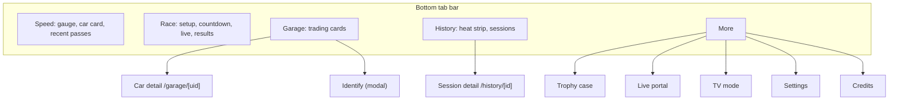

# Redline ID — Design Language

The canonical reference for **how Redline ID looks and feels**: the visual and interaction
system every screen follows. Since V1 that system is **Redline**, the motorsport identity
specified in [`docs/design/redline-v1/SPEC.md`](../design/redline-v1/SPEC.md) and recorded in
[ADR-0016](../adr/0016-redline-v1-visual-identity.md). This page summarises it and is grounded
in the live tokens in [`apps/mobile/src/theme/tokens.ts`](../../apps/mobile/src/theme/tokens.ts)
(the `colorsR` / `fontR` / `radiusR` / `skewR` / `typeR` block).

> **Living document.** When a token or pattern changes in code, update it here and in SPEC.md.
> Architectural choices are backed by an [ADR](../adr/). Exact visual values (hex, sizes, SVG
> paths) live in `docs/design/redline-v1/source/*.dc.html`; SPEC.md wins for behaviour, data
> and accessibility.

---

## 1. Personality & principles

Redline ID is a **race-day instrument** for a toy track: loud, fast, legible from across a
play mat, and honest about what the portal can measure.

1. **Slant means speed.** Display type is italic. Buttons, tags, chips and plates lean
   (`skewX`). **Numbers never lean**: speeds, times and counts are upright tabular figures.
2. **One loud colour.** Asphalt underneath, Track Orange (`flame`) on top. Electric blue means
   fastest lap / link. Caution yellow means record / trophy. Green means connected / go. Red
   means fault / redline / start lights.
3. **Trackside kit, used sparingly.** Kerbs, checkers, race plates, start lights, speed
   streaks, chevrons and flames: one or two per screen, never wallpaper.
4. **Crisp, not bubbly.** Panels have square corners. Roundness is reserved for pills, plates,
   light pods and the phone itself.
5. **Don't invent data.** The portal sees gate crossings only. Projections are labelled
   ("PACE ESTIMATE"), and missing data falls back (AVG LAP) or is omitted.
6. **Not a Hot Wheels re-skin.** The product is **Redline ID**. No Mattel logos, wordmarks,
   flame logos or packaging in UI chrome or store art. The not-affiliated disclaimer stays in
   Settings and Credits.

---

## 2. Color

All values are `colorsR` tokens. Text on a `flame`, `caution`, `electric` or `chalk` fill is
always `asphalt`; never white on orange.

| Token | Hex | Use |
|---|---|---|
| `asphalt` | `#07090F` | Screen background; dark ink on bright fills |
| `pitWall` | `#0B0E15` | Tab bar, photo bays, page backgrounds behind boards |
| `pitLane` | `#111620` | Panels, cards, list groups (default surface) |
| `inset` | `#0D1119` | Inputs, steppers, locked medallions |
| `gridBox` | `#1A2230` | Lap-number cells, date tabs, tags |
| `trackGrey` / `steel` / `barMuted` | `#161C27` / `#232C3B` / `#2E3A4D` | Troughs, OFF switches, muted chart bars |
| `chalk` | `#F5F7FA` | Primary ink, kerb white, race-plate fill |
| `inkSecondary` / `inkMuted` | `#A3B1C2` / `#8494A6` | Supporting copy / eyebrows and units (≥ 4.5 : 1 on pitLane) |
| `inkDisabled` | `#6E7D8E` | Decorative only (dashed unidentified-car outline) |
| `flame` | `#FF6A13` | **Primary accent**: CTAs, active tab, live state, gauge arc |
| `electric` | `#2BD1FF` | Fastest lap, links, best-lap ghost |
| `caution` | `#FFD23F` | Records, NEW BEST, trophies |
| `greenFlag` / `redFlag` | `#39D98A` / `#FF4D5E` | Connected, GO / faults, redline, start lights |

**Status fills** (chips, badges) are a 0.08–0.15 fill plus a 1 pt border in the same hue
(`colorsR.status`). The **History heat ramp** `#161C27 → #5A2A0E → #A8460C → #FF6A13` also
steps in lightness, so it reads without colour. Speed zones keep `speedGauge.zones`
(0–120 / 120–220 / 220–300) in green, caution and red.

---

## 3. Typography

Three bundled Google Fonts families (SIL OFL 1.1, credited in `THIRD_PARTY_NOTICES.md` and on
Credits), loaded at start-up with a system-font fallback. Use the `RText` helper with a
`typeR` variant; on iOS set **only `fontFamily`** (never `fontWeight`/`fontStyle`, which cause
faux bold/italic).

| Role | Face (`fontR`) | Where |
|---|---|---|
| Display | Barlow Condensed Black Italic (`display`) | Wordmark, screen titles, race digits, FINISH, primary buttons |
| Display-2 | Barlow Condensed ExtraBold Italic (`display800`) | Section titles, car names, ghost buttons, tab labels |
| HUD | Chakra Petch SemiBold / Bold / Medium | Every number, eyebrows, chips, lap times, units |
| Body | Barlow Regular / Medium / SemiBold | Reading copy, row labels, hints |

Key `typeR` sizes: `screenTitle` 52, `gaugeReadout` 84, `heroNumber` 64, `statValue` 30,
`lapTime` 20, `sectionTitle` 17, `eyebrow` 11, `body` 16, `bodySmall` 14. Display and HUD
styles are upper-case and carry `tabular-nums`; body copy is sentence case. Body text scales
with Dynamic Type; display and HUD cap at 1.3×.

---

## 4. Shape, skew, spacing and depth

- **Radius** (`radiusR`): panels **0**; plates 6–10; light pods 14; pills 999.
- **Skew** (`skewR`): −12° buttons, tags, chips, switches; −10° plates, chart bars and heat
  cells; −14° corner ribbons; −20° lap segments; −24° the active-tab indicator. A skewed
  container counter-skews its content (`SkewBox`) so text stays upright. Full-width skewed
  buttons are inset by `height × tan(12°)` per side.
- **Spacing:** screen gutter 16 (iPad uses `useLayout().gutter`), panel padding 12–14, list
  rows 54 tall, stat cells 2 apart on asphalt (reads as a hairline grid).
- **Depth:** no drop shadows on panels. Glow marks a live state only: the gauge arc, the
  on-portal garage card, lit start lights and connected dots. Accent "top bars" are real 3–5 pt
  `View`s, not inset shadows.

---

## 5. Trackside kit and iconography

Motif primitives live in `apps/mobile/src/components/redline/` and are always decorative
(hidden from VoiceOver): `Kerb`, `Checker`, `RakeLines`, `TrackLane` (SVG `<Pattern>` fills,
because React Native has no repeating gradients), `RacePlate` and `Roundel` (number from the
pure `plateNumber`, position by `firstSeen`), `StartLights`, `SpeedStreaks`, `Chevrons`,
`FlameTongues`, `CarSilhouette` (**fallback only**: use `CarPhoto` when catalog artwork exists;
dashed outline for unidentified cars), `Medallion` and `Wordmark`.

Chrome icons are **MaterialCommunityIcons**, never emoji:

| Icon | Meaning |
|---|---|
| `speedometer` · `flag-checkered` · `garage` · `history` · `dots-horizontal` | The five tabs |
| `trophy-outline` · `access-point` · `television-play` · `cog-outline` · `information-outline` | More rows |

**Achievement icons** (`apps/mobile/src/achievements/icons.ts`; a test asserts every catalog
id has one and that each glyph exists):

| id | icon | id | icon |
|---|---|---|---|
| speed-100 | `speedometer-slow` | race-marathon | `road-variant` |
| speed-200 | `lightning-bolt` | lap-sub3 | `timer-outline` |
| speed-240 | `fire` | collect-1 | `key-variant` |
| speed-290 | `star-four-points` | collect-5 | `car-side` |
| race-first | `flag-checkered` | collect-10 | `view-grid-outline` |
| race-10 | `repeat` | collect-25 | `layers-triple-outline` |
| laps-100 | `timer-sand` | | |

The catalog keeps its emoji `icon` field for share text and tests only. Empty states use motif
illustrations (a `TrackLane` with an outline car), and missing photos use the dashed "?"
roundel.

---

## 6. Navigation model

A persistent **bottom tab bar** (Speed · Race · Garage · History · More) with detail screens
pushed over their owning tab ([ui-and-design.md](ui-and-design.md) §2).

```mermaid
flowchart TD
    subgraph Tabs["Bottom tab bar"]
        Speed["Speed: gauge, car card, recent passes"]
        Race["Race: setup, countdown, live, results"]
        Garage["Garage: trading cards"]
        History["History: heat strip, sessions"]
        More["More"]
    end
    More --> Trophy["Trophy case"]
    More --> Live["Live portal"]
    More --> TV["TV mode"]
    More --> Settings["Settings"]
    More --> Credits["Credits"]
    Garage --> CarDetail["Car detail /garage/[uid]"]
    Garage --> Identify["Identify (modal)"]
    History --> SessionDetail["Session detail /history/[id]"]
```

- **≤ 5 tabs.** Everything else lives behind More.
- The tab bar is `pitWall` with a hairline top border and `tabLabel` text. The active tab is
  `flame` with a skewed 3 pt indicator that springs between tabs (instant under reduce motion).
- Detail screens use `ScreenHeader` with an electric back link that falls back to the owning
  tab when there is no history.
- `PortalStatusRibbon` shows on every tab except Speed, where the header `StatusChip` replaces
  it. Both read the same selectors and actions.

---

## 7. Core components

Built in `components/redline/` or restyled in place with stable props. Reuse these rather than
inventing new ones.

| Component | Pattern |
|---|---|
| `RaceButton` | Primary (flame fill, asphalt display text, 56 tall), ghost (chalk border), destructive (red); skewed −12°; optional chevron; `compact` (44 pt) for inline actions |
| `StatusChip` / `PortalStatusRibbon` | Status pill in the soft status fills; tap connects / retries / confirms disconnect via `usePortalStatusAction` |
| `ScreenHeader` / `SectionHeader` | Screen title with optional subtitle, right slot and back link / section title, rule, count, optional right slot or numbered index (Settings) |
| `StatCell` / `StatRow` | pitLane cell: eyebrow, `statValue`, unit, optional accent top bar |
| `TimingRow` | 50 pt row: lap-number cell, time, delta, gate speed; fastest in electric, running at 75 % |
| `FilterChip` / `SkewSwitch` | Skewed chips with an optional series swatch / skewed switch with `role="switch"` and a spring knob |
| `SettingRow` / `SettingGroup` / `SettingsSection` / `CompactStepper` / `TelemetrySegmentedControl` | Square pitLane groups, 54 pt rows, control on the label line, hint below |
| `Notice` / banners | pitLane with a 3 pt tone bar, HUD eyebrow and body (`BleStatusBanner`, `PersistenceStatusBanner`, Live notices) |
| `Speedometer` | `variant="redline"`: 240° arc, zone ring, comet tip and flames, driven by the existing UI-thread choreography. **`'needle'` stays the default for TV** |
| `TrophyUnlockBanner` | Root-level toast from newly stamped unlocks: medallion, caution bar, 2.5 s hold, gated haptic |

Screen layouts that render fixtures share store-free boards (`GarageBoard`, `HistoryBoard`,
`TrophyCase`), so `/dev/redline?section=…` reproduces each mockup without touching stores.

---

## 8. Motion

All decorative motion goes through `useTelemetryMotion` (OS reduce-motion **or** the
`reduceMotion` setting). Under reduce motion everything is static; the tab indicator switches
instantly.

| Moment | Motion |
|---|---|
| Pass on Speed | Arc and comet follow the existing sweep (620 ms up, 900 ms hold, spring back); flames fade with the value; NEW BEST pops; the newest bar grows (240 ms) |
| Countdown tick | Digit springs 1.15 → 1, echoes slide in, lights bloom; GO turns everything green |
| Lap complete | Kerb segment fills (300 ms); a new `TimingRow` slides in (220 ms) |
| Finish | Checker band slides in (350 ms); NEW RECORD stamp drops (scale 1.4 → 1) |
| Trophy unlock | Banner springs down, holds 2.5 s, rises out |
| Connect | Radar rings pulse on a 2.4 s loop; dashed ring rotates 20 s per revolution |

---

## 9. Haptics and sound

Gated by the **Haptics** and **Sound** settings, off on web:

- **Pass** → medium impact; **new record** → success notification; **car detected** → light
  selection tick.
- **Trophy unlock** → success notification.
- Race countdown, lap, best-lap and finish cues are unchanged in `useRaceSession`.

---

## 10. Connection UX

**The app connects itself.** One root controller owns the BLE or demo transport for the whole
session, so Race and Live never depend on Speed mounting.

- **Auto-connect** on BLE-capable devices outside demo mode, with finite scan windows and
  capped backoff. Web and the Simulator stay in demo mode and never load BLE.
- **First run:** with no portal, car, pass or demo mode, Speed shows the "Find your portal"
  state (a pure, tested selector; no persisted onboarding flag) with a Try demo mode action.
- **The status chip is the control:** tap to connect or retry; disconnect asks for
  confirmation and pauses automatic reconnect. The Settings portal card uses the same action.
- **Fail gracefully:** Bluetooth off, permission denied and portal not found each get copy and
  a recovery action, never a spinner loop.
- **Storage honesty:** when SQLite is unavailable the tab shell shows the session-storage
  banner (Browser session on web; Saving unavailable / limited on native).

---

## 11. Accessibility

- Touch targets ≥ 44 pt (tabs, back links, steppers, chips, switches).
- Every number is spoken with its unit ("247 scale miles per hour"); deltas carry a sign and
  "faster" / "slower".
- Motifs are hidden from assistive technology. Strips, lap segments and progress bars carry
  one summarising label.
- Colour is never the only signal: zones have labelled ticks, series print their names, tags
  print their type, the heat ramp steps in lightness.
- Existing `announceForAccessibility` calls (status changes, car changes, countdown) are kept;
  trophy unlocks are announced.

---

## 12. Voice & microcopy

- **Short, energetic, plain.** "START RACE", "RACE AGAIN", "Tap to identify".
- Speeds are **scale mph** (or km/h) with the unit always visible; units and calibration
  respect Settings.
- Empty and error states are friendly and actionable: "No cars yet", "Your collection lives
  here. Send a car through the portal."

---

## 13. Legacy: Trackside Telemetry (TV only)

The pre-V1 **Trackside Telemetry** tokens (`colors`, `fontSize`, `fontWeight`, `radius`,
`radiusT`, `spacing`, `elevation`, `speedGauge` colours…) remain in `tokens.ts` unchanged.
They are **legacy**: only TV mode (`tv.tsx`, `TvStage`, the needle `Speedometer`) and any
not-yet-migrated code read them. New and migrated surfaces read only the Redline tokens. Do not
delete or rename the legacy tokens while TV depends on them. See
[`docs/design/ui-overhaul/`](../design/ui-overhaul/) for that system's history.

---

## 14. References

- Spec, issues, mockups and implementation log: [`docs/design/redline-v1/`](../design/redline-v1/)
- Decision record: [ADR-0016](../adr/0016-redline-v1-visual-identity.md)
- Tokens: [`apps/mobile/src/theme/tokens.ts`](../../apps/mobile/src/theme/tokens.ts)
- Screen intent: [`ui-and-design.md`](ui-and-design.md)
- UI stack: [ADR-0005](../adr/0005-ui-stack-reanimated-skia-expo-router.md) · gauge:
  [ADR-0009](../adr/0009-phase-2a-gauge-svg-first.md) / [ADR-0010](../adr/0010-phase-2b-flame-fx-svg.md)
  · TV: [ADR-0015](../adr/0015-external-display-tv-mode.md)
- Store art and screenshots: [`docs/release/screenshots/`](../release/screenshots/)
