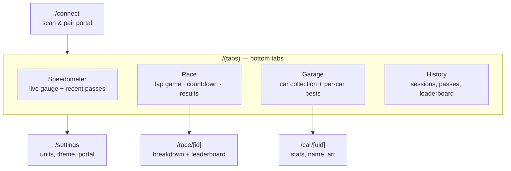
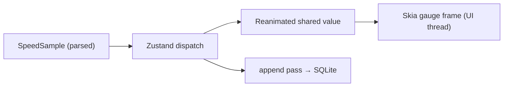

# UI & Design

Design intent and component plan for the "more attractive UI" goal. Stack rationale is in
[ADR-0005](../adr/0005-ui-stack-reanimated-skia-expo-router.md). This is a living
document; treat specifics (colors, exact screens) as a starting point.

> **See also:** the [**Design Language**](design-language.md) is the canonical reference for
> the visual + interaction system (color/type/spacing tokens, navigation model, core
> components, motion/haptics, connection UX). This doc covers *what each screen is for*; the
> design language covers *how it should look and feel*.

## 1. Design principles

- **Kid-friendly, arcade racing energy.** Big numbers, bold color, motion, sound/haptics —
  legible at a glance from across a play mat.
- **The speedometer is the hero.** When a car passes, the gauge should feel alive
  (needle snap, glow, flames at high speed) — a real animation, not a static image.
- **Glanceable state.** Connection status, current car, and last speed always obvious.
- **Offline-first, no accounts.** Everything works on the device with no setup beyond
  pairing the portal.

## 2. Screen map (Expo Router)

> **Status:** this bottom-tabs map is the **target** (design "Proposal A"). v1.0 shipped an
> interim home "hub" — the speedometer plus a vertical stack of mode buttons — and is being
> realigned to these tabs in epic **#28**. See [Design Language §6](design-language.md#6-navigation-model).

Screen responsibilities:

| Screen | Purpose | Key data |
|--------|---------|----------|
| Connect | Scan for `HWiD`, pair, show BLE/permission state | BLE service |
| Speedometer | Live gauge, current car, recent passes, best speed | runtime store |
| Race | Lap race (5/10/15/20), 3-2-1 countdown, live laps, results | runtime + SQLite |
| Garage | Car collection, per-car best speed/lap, names/art | SQLite |
| Car detail | One car's history and identity (NFC UID, serial, Mattel id) | SQLite + protocol |
| History | Past sessions/passes, leaderboard | SQLite |
| Settings | Units, theme, manage portal, reset | MMKV |

(Mirrors and extends the upstream tools: `dashboard.py` → Speedometer, `race_mode.py` →
Race, plus the roadmap's persistent garage/collection.)

## 3. The speedometer gauge (hero component)

- **Rendering:** `@shopify/react-native-skia` canvas — arc track, colored speed zones
  (green → yellow → red), tick marks, animated needle, digital readout.
- **Motion:** `react-native-reanimated` shared value `speed` drives the needle via
  `useDerivedValue`; new samples animate with `withSpring`/`withTiming` for an
  interruptible, springy needle.
- **Effects:** Skia particle/flame layer activates past a threshold (the upstream "flames
  at 100+ mph", made real); subtle glow on new best.
- **Feedback:** `expo-haptics` pulse on car detection and on a new record; optional sound.
- **Data path:** BLE indication → `@redlineid/protocol` parse → Zustand → Reanimated
  shared value → Skia frame. High-frequency values stay on the UI thread to avoid
  re-render churn ([ADR-0006](../adr/0006-state-management-and-persistence.md)).

## 4. Design tokens (starting point)

Begin with a small hand-rolled token set (see ADR-0005); adopt a component library only if
it earns its place.

| Token group | Initial direction |
|-------------|-------------------|
| Color | Dark "track" background; high-contrast accent (Hot-Wheels-style flame orange / electric blue); semantic speed zones green/yellow/red |
| Type | Bold condensed display face for speeds/numbers; clean sans for body |
| Spacing | 4-pt base scale |
| Radius / elevation | Rounded, chunky cards; soft glow on active elements |
| Motion | Springy, snappy (Reanimated); 60–120 fps target |
| Haptics | Light tick on detect; success thud on record |

> **Trademark note:** this is an unofficial, Mattel-unaffiliated project (see README
> disclaimer). Evoke a racing aesthetic; do **not** copy Hot Wheels logos/brand assets.

## 5. Accessibility & robustness

- Respect "reduce motion": damp gauge animation/flames when the OS flag is set.
- Color-blind-safe speed zones (pair color with position/labels, not color alone).
- Clear empty/error states: Bluetooth off, permission denied, portal not found,
  disconnected (with retry).
- Large tap targets and readable contrast for young users.

## 6. Build-before-hardware

The full UI can be developed against **mocked portal events** (a fake event generator
feeding the same Zustand actions), so screens and the gauge can be designed and reviewed on
the iOS Simulator / web before BLE is wired up. This de-risks the UI work and lets it run in
parallel with the protocol port ([Roadmap](../ROADMAP.md) Phase 1–2).
