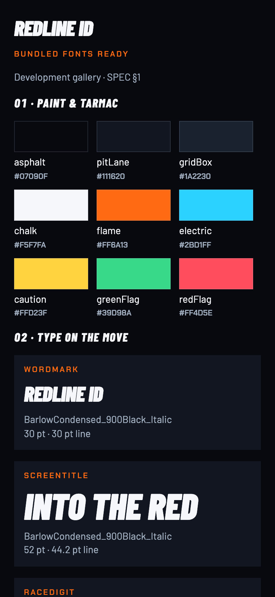
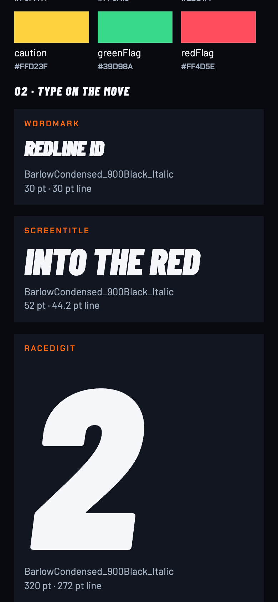
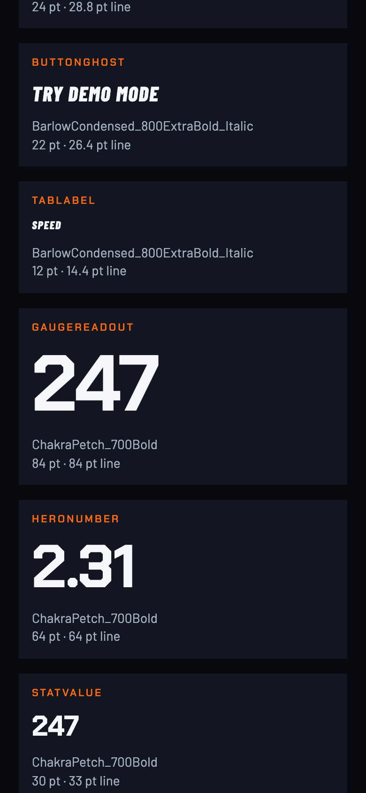
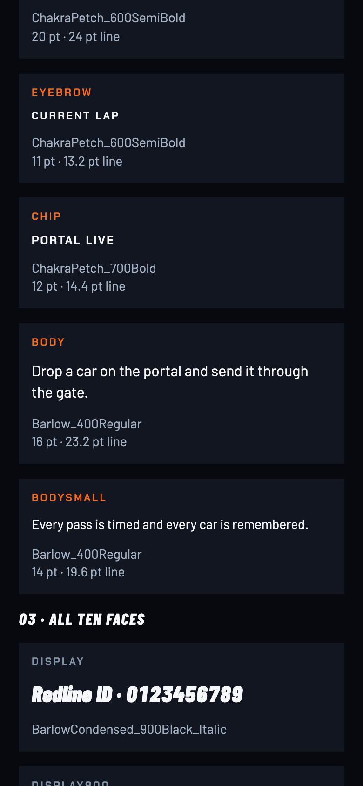
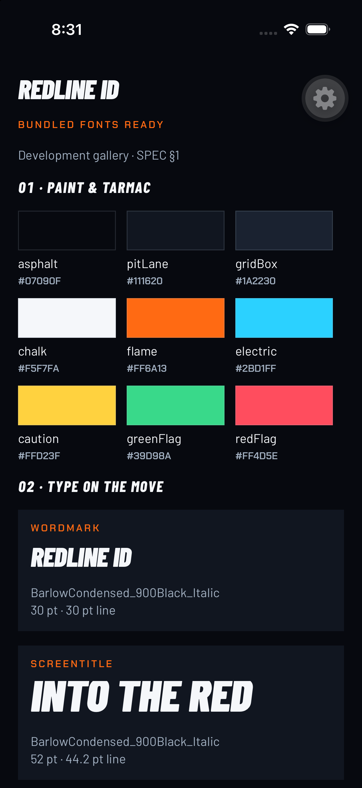
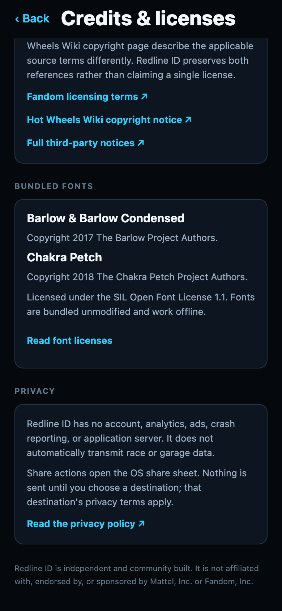
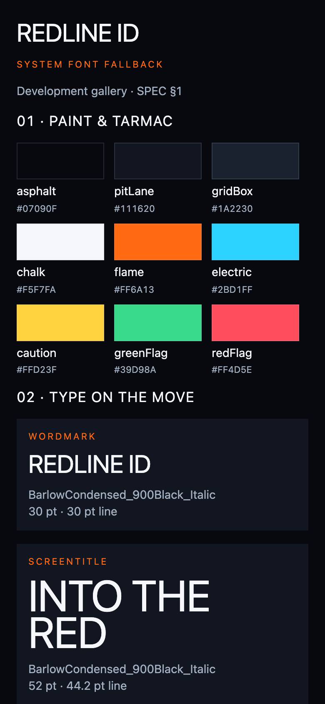

# RL-01 review

Reference: [Main.png](../../png/Main.png), “Paint & tarmac” and “Type on the move”.
Exact values: [Main.dc.html](../../source/Main.dc.html) and [SPEC §1](../../SPEC.md#1-tokens).
The phone gallery stacks the identity sheet's palette and font specimens vertically.

| Design | Web implementation, 390×844 @2× |
| --- | --- |
|  |  |

| Display and countdown | Upright HUD | Body and metadata |
| --- | --- | --- |
|  |  |  |

| iPhone 17 Pro, iOS 26.5 | Credits font notices (no mockup) | Failed font loading |
| --- | --- | --- |
|  |  |  |

The simulator capture is at its native 1206×2622 resolution; its floating gear is
development-client chrome. All screenshots are actual app captures. No production
screen has been migrated to Redline typography in this issue.
[Production Speed smoke capture](speed-production-web.png) confirms the current
demo screen remains usable; its Redline migration is RL-05. Production
`/dev/redline` redirects home, and `/tv` still renders the needle gauge.

To reproduce:

```sh
npm run web --workspace mobile -- --port 8082
# In another terminal, with Playwright installed (or available via NODE_PATH):
PLAYWRIGHT_CHANNEL=chrome node docs/design/redline-v1/tools/check-rl-01.cjs
```

The script verifies actual loaded browser font faces, all 17 variants plus ten face
specimens, offline license text, and failure fallback. It writes
[`web-verification.json`](web-verification.json) and the web captures above.
For failure injection it strips Expo's server-rendered font CSS (otherwise Expo
regards those faces as already loaded) and rejects local TTF requests. This causes
the real runtime loader to reject; the gallery then renders with the system font.

For iOS, open `/dev/redline` in the existing development client connected to Metro.
The gallery is absent from navigation and redirects to home in production.
