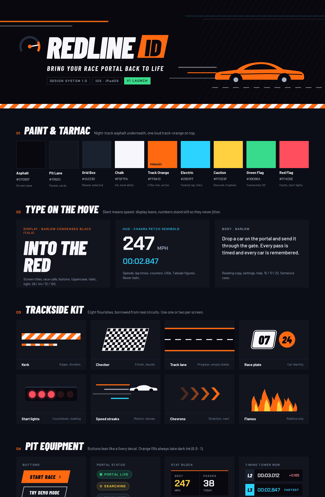
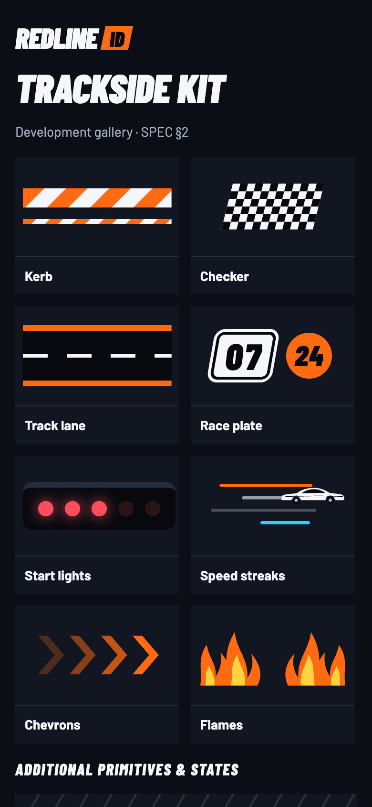
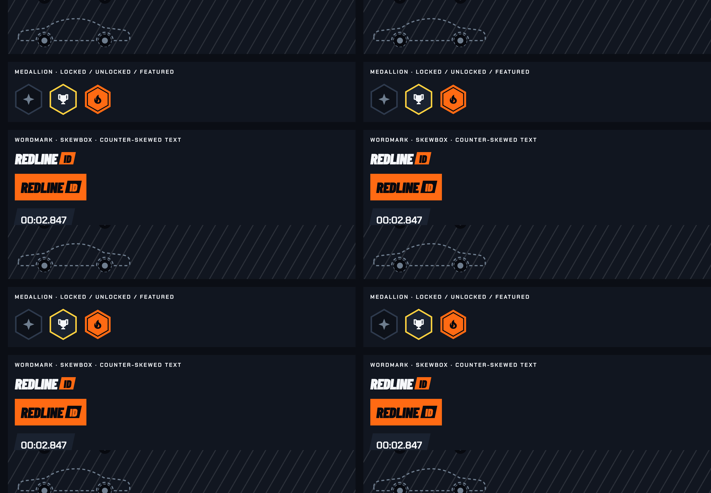
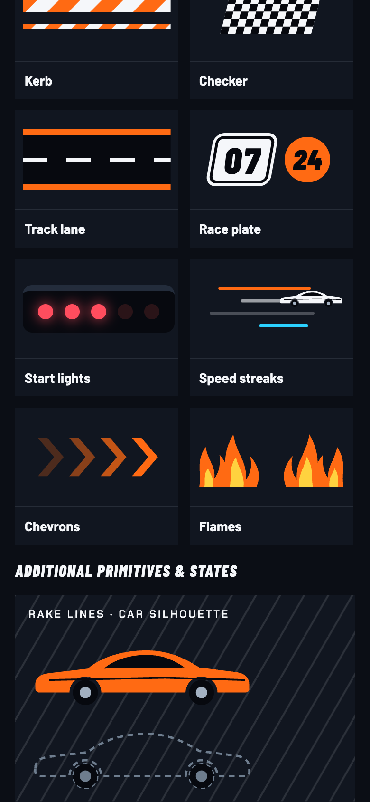
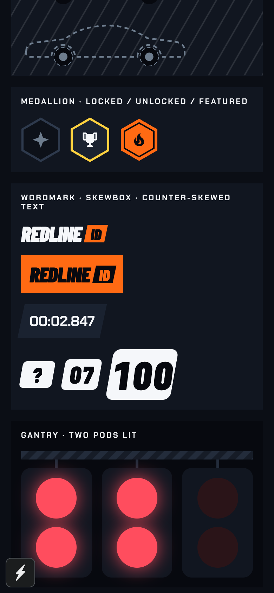
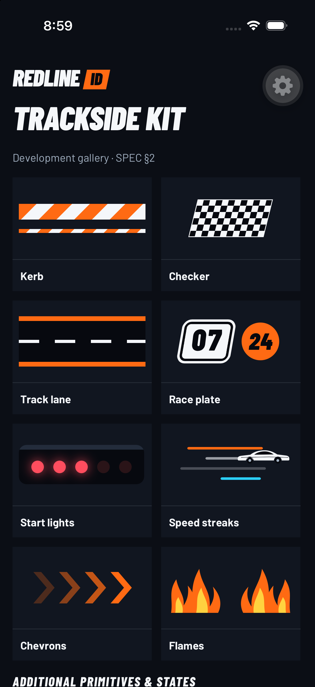

# RL-02 review

Open `/dev/redline?section=motifs` with Expo web running. Phone captures use
390×844 with deviceScaleFactor 2; the wide capture uses a 1440px viewport.
The source app runs the existing demo controller. The gallery's specimen values
are isolated from stores and production screens.

| Reference: Main's Trackside kit | Phone implementation |
| --- | --- |
|  |  |

| Car fallback and medallions | Wordmarks and plates | Start-light states |
| --- | --- | --- |
|  |  |  |

Additional references inspected: [Speed](../../png/Speed.png),
[Countdown](../../png/Countdown.png), and [Achievements](../../png/Achievements.png).
Flames use Speed's exact paths as required by the spec. Main's larger demo flame
shape is deliberately not substituted. Phone tiles use smaller instances to fit
the narrow viewport; the primitives expose the source sizes.

[`web-verification.json`](web-verification.json) records zero page/console errors,
five distinct pattern IDs, and no exposed decorative SVGs. Reproduce with
[`check-rl-02.cjs`](../../tools/check-rl-02.cjs) and Playwright available on NODE_PATH.

The iPhone 17 Pro simulator capture verifies the first viewport's native SVGs,
fonts, plates, and lights. It caught clipped rotated pattern tiles on iOS; kerb and
rake now draw wrapped diagonal geometry inside unrotated SVG pattern tiles. The
Simulator GUI is unavailable, so lower native specimens were not scrolled. The
gear is development-client chrome. Native VoiceOver,
physical BLE, haptics, and glass were not tested by this static motif issue.
