# RL-03 review

Open `/dev/redline?section=controls` with Expo web running. The gallery has isolated
specimen values; portal callbacks report their action without controlling hardware.
The reduce-motion specimen uses the real setting, restored by the verification script.

| Reference: Main's Pit equipment | Phone implementation |
| --- | --- |
|  | 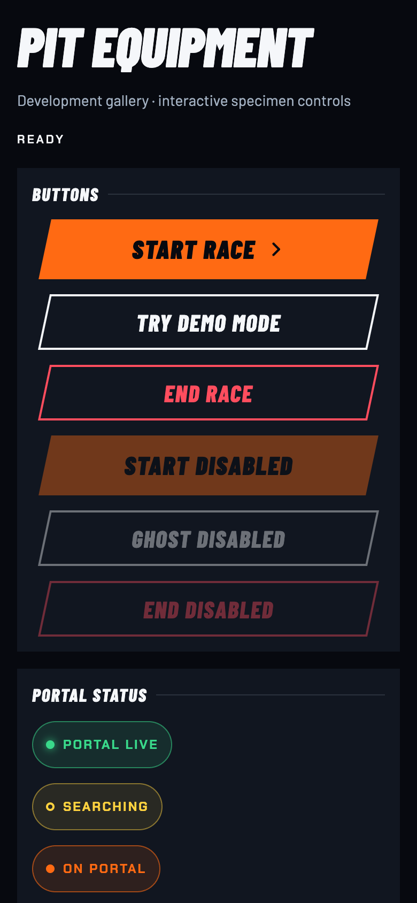 |

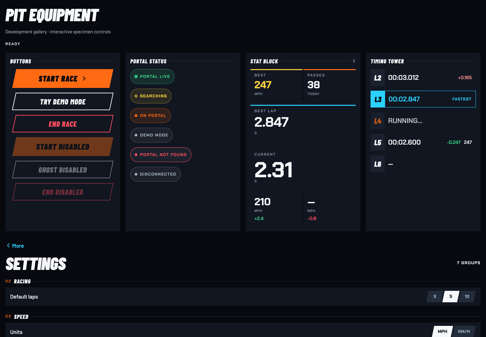

| Portal states | Stat cells | Timing rows |
| --- | --- | --- |
| 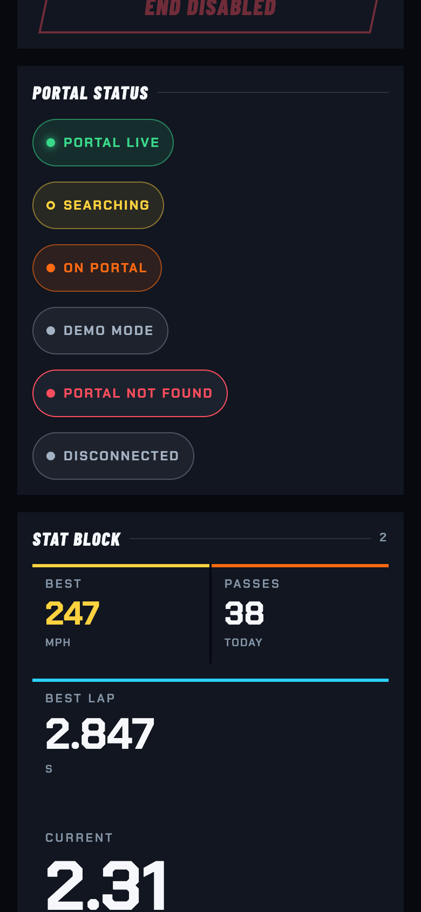 | 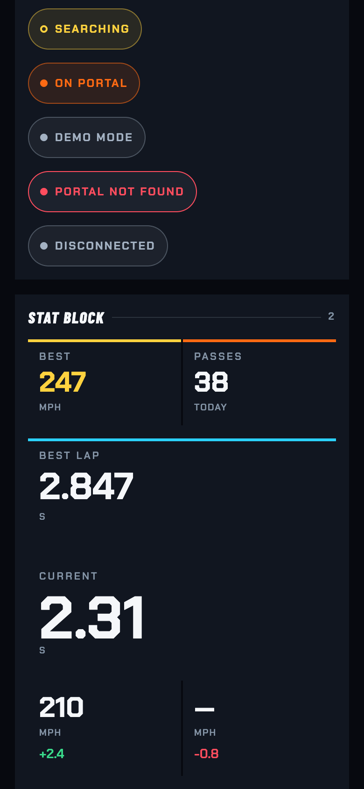 | 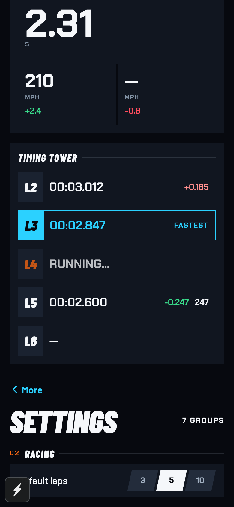 |

| Settings reference | Shared control specimens | Existing Settings caller |
| --- | --- | --- |
| 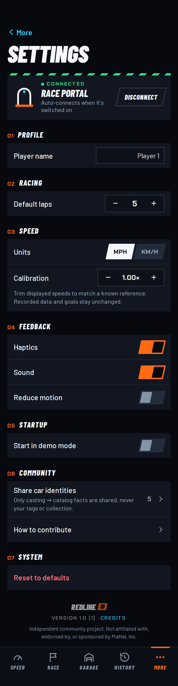 | 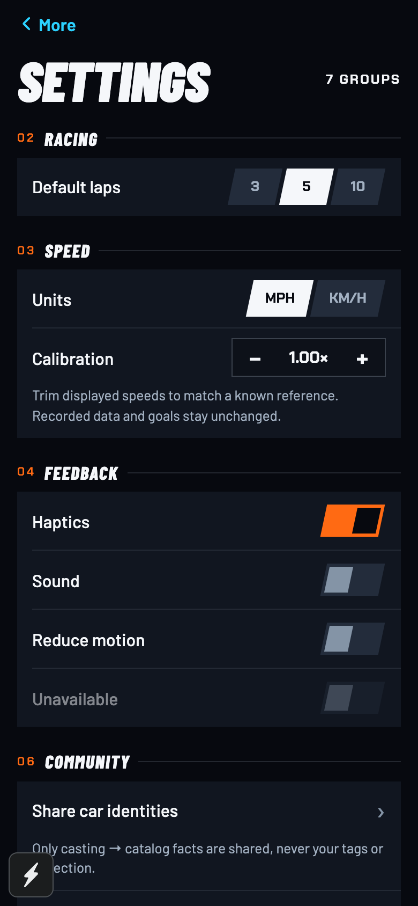 | 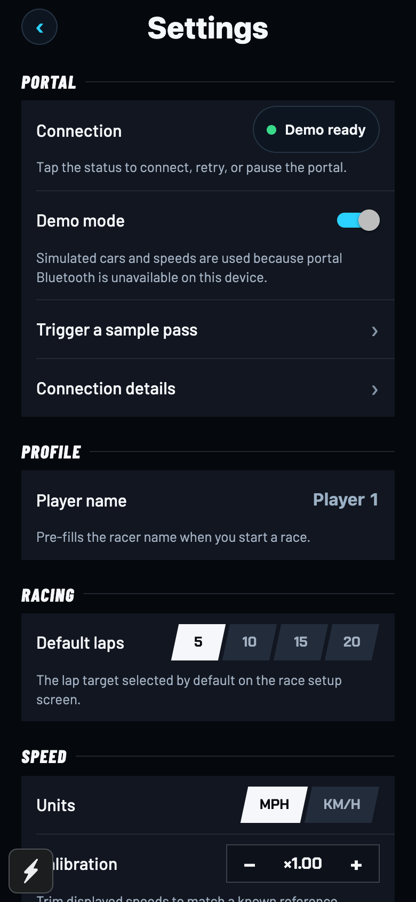 |

| Pressed button | Series filters | iOS first viewport |
| --- | --- | --- |
| 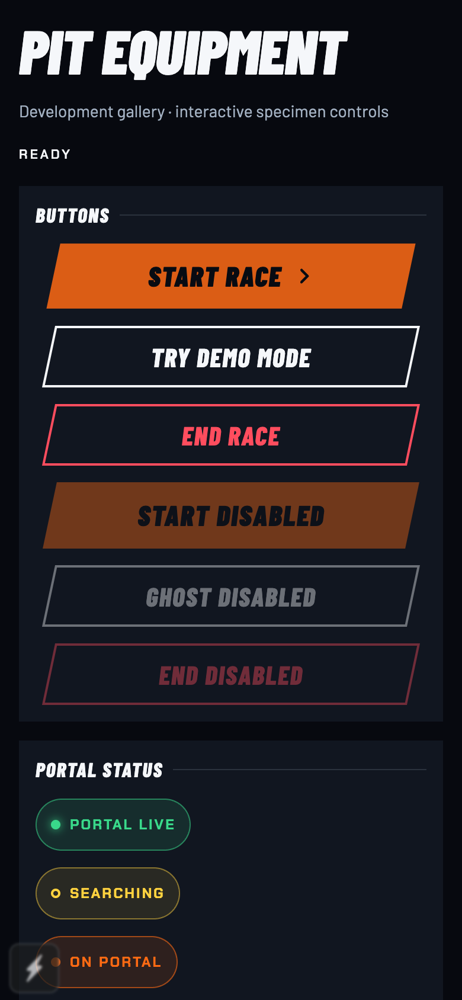 | 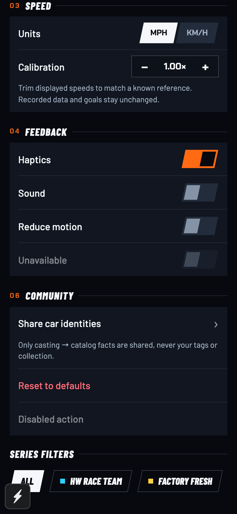 | 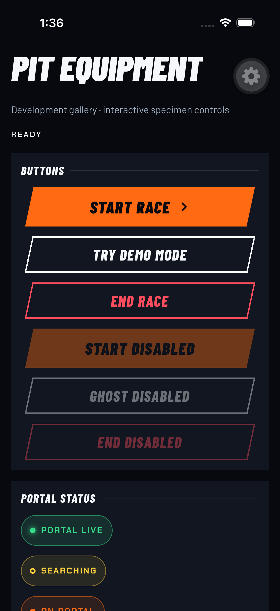 |

All phone web captures use 390×844 @2×. The identity board's four columns stack on
phone. Status chips are at least 44 pt tall; segments, switches, and filter shapes
sit inside 44 pt targets. This deliberately expands the smaller visible controls
from the artboards. The ghost and primary sizes, faces, skew, color, and insets
follow the source. Error and disconnected status labels remain visible in addition
to the four artboard tones.

`TelemetryValue` preserves its existing props. Without a label/accent it remains a
readout for existing padded callers; `StatCell` adds the complete panel. The new
look is visible in [Speed's existing stat cards](speed-screen-web.png), compared
with [Speed's reference](../../png/Speed.png). Full Speed and Settings screen
composition is handled by RL-05/RL-14. [TV smoke capture](tv-smoke-web.png) uses a
1440×900 viewport and retains the legacy needle gauge.

[`check-rl-03.cjs`](../../tools/check-rl-03.cjs) and
[`web-verification.json`](web-verification.json) verify every control's target,
button insets, connect/retry, cancel/confirm disconnect, Space-key switching,
selected tabs and filters, stepper bounds, and both app/OS reduced motion. The
script waits for client hydration and settled indicator geometry before captures.
No browser errors remain. The installed RN Web requires explicit ARIA checked,
selected, and pressed state; Space handling is supplied for its non-button roles.

Native first-viewport buttons, fonts, and chips were inspected on iPhone 17 Pro.
The gear is development-client chrome. Simulator GUI scrolling is unavailable, so
remaining native specimens, VoiceOver, physical haptics, BLE, and glass remain
device follow-ups.
