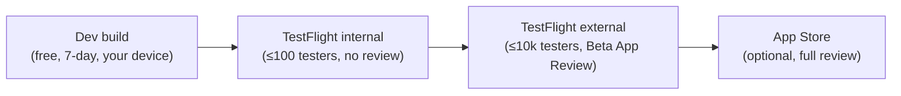

# Distributing Redline ID via TestFlight (and Android)

This is the **Phase 4** runbook: turn the working dev build into something you can hand to
family and friends over **TestFlight**, then (optionally) the App Store. It picks up where
[`ios-dev-build.md`](ios-dev-build.md) leaves off — that guide is for getting the app onto
*your own* device for development; this one is for **distribution to other people**.

> **The cost gate (read first).** TestFlight requires a **paid Apple Developer Program
> membership — $99/yr** ([ADR-0008](../adr/0008-ios-distribution-with-eas-and-testflight.md)).
> There is no free TestFlight. Until you enrol, the free **7-day dev build** (Path A in the
> dev-build guide) is the only way onto a physical iPhone, and it only covers *your* device,
> not other testers'. Everything below assumes you've decided the $99 is worth it.

---

## The distribution ladder



For a family hot-rod app, **TestFlight internal testing** is almost certainly your
destination: up to 100 testers, builds available in minutes with **no App Review**, and each
build is good for 90 days. You only need external testing or the App Store if you want to go
past 100 people.

---

## Prerequisites checklist

- [ ] **Paid Apple Developer Program** membership — enrol at
      <https://developer.apple.com/programs/> (Apple ID + $99/yr; approval can take 24–48 h).
- [ ] A free **Expo account** (<https://expo.dev>) for EAS cloud builds.
- [ ] **EAS CLI**: `npm install -g eas-cli` (or call it with `npx eas-cli@latest`).
- [ ] The app is already configured (nothing to do — verify only):
  - bundle identifier **`com.burkben.redlineid`** ([`app.json`](../../apps/mobile/app.json)),
  - Bluetooth usage string + `react-native-ble-plx` plugin (central mode),
  - `ios.infoPlist.ITSAppUsesNonExemptEncryption: false` (see
    [Export compliance](#export-compliance) before a *public* release),
  - `eas.json` profiles `development` / `simulator` / `preview` / `production`.

> **Always run `eas` commands from `apps/mobile/`.** EAS detects the npm workspace and
> installs from the repo root; `@redlineid/protocol` is consumed as TypeScript source via
> Metro, so there's no separate package to publish or prebuild.

---

## Step 1 — One-time project + Apple setup

```bash
cd apps/mobile
eas login                  # your free Expo account
eas init                   # links the project; writes extra.eas.projectId into app.json
```

`eas init` will add an `extra.eas.projectId` to `app.json` — **commit that change** (it's not
a secret; it identifies the Expo project).

### Apple credentials

Let EAS manage signing — it's by far the least painful path. On the first iOS build (next
step) EAS will offer to **create the Distribution Certificate and provisioning profile for
you**; say yes. It can also create the **App Store Connect app record** automatically at
submit time, or you can pre-create it at <https://appstoreconnect.apple.com> → **Apps → +** →
New App, using bundle id `com.burkben.redlineid`.

You'll be prompted for an **app-specific password** or to sign in to your Apple account so EAS
can talk to App Store Connect. Generate one at <https://account.apple.com> → **Sign-In and
Security → App-Specific Passwords** if asked.

---

## Step 2 — Build a release binary

```bash
cd apps/mobile
eas build --profile production --platform ios
```

This runs on Expo's servers (no local Xcode needed). The `production` profile
`autoIncrement`s the build number, and because `cli.appVersionSource` is **`remote`**, EAS
owns the build-number sequence — you bump the human-facing version (`expo.version` in
`app.json`, currently `1.0.0`) only when you want a new marketing version.

When it finishes you get a build page with the `.ipa`. You don't install this one directly —
it goes to TestFlight via submit.

> **Tip:** `eas build --profile production --platform ios --auto-submit` does Step 2 **and**
> Step 3 in one shot once submit is configured.

---

## Step 3 — Submit to TestFlight

```bash
cd apps/mobile
eas submit --profile production --platform ios
```

EAS uploads the latest `production` build to App Store Connect. The first run will ask for:

- **Apple ID** (your developer account email),
- **App Store Connect App ID** (`ascAppId` — the numeric id from the app's App Store Connect
  URL, once the app record exists),
- **Apple Team ID** (from <https://developer.apple.com/account> → Membership).

To avoid re-entering these every time, add the **non-secret** ones to `eas.json` under
`submit.production.ios` (leave them out if you'd rather be prompted):

```jsonc
"submit": {
  "production": {
    "ios": {
      "appleId": "you@example.com",
      "ascAppId": "1234567890",
      "appleTeamId": "ABCDE12345"
    }
  }
}
```

After upload, App Store Connect **processes** the build for a few minutes (you'll get an email
when it lands in TestFlight).

---

## Step 4 — Invite testers

In App Store Connect → your app → **TestFlight**:

- **Internal testers** (recommended for family): add them under **Internal Testing** (they
  must be in your team as Users, up to 100). Builds are available **immediately, no review**.
- **External testers** (>100 people, or folks you don't want in your team): create an
  **external group**, add emails or share a **public link**. The *first* external build needs
  **Beta App Review** (usually < 24 h); later builds of the same version don't.

Each tester installs the **TestFlight** app from the App Store, accepts the invite, and gets
Redline ID. Remind them: **Bluetooth + a physical portal** are required for live telemetry —
without a portal they'll see the demo/mock mode.

### App metadata URLs

For the TestFlight **Test Information** page (and a future App Store listing), the project
ships a small public site (source in [`site/`](../../site)), served by GitHub Pages from the
`gh-pages` branch:

- **Privacy Policy URL:** <https://burkben.github.io/HotWheelsID/privacy/>
- **Marketing URL:** <https://burkben.github.io/HotWheelsID/>

Both are optional for TestFlight but required for a public App Store release. Edit the page
content under `site/` (the canonical policy text lives in
[`docs/legal/privacy-policy.md`](../legal/privacy-policy.md)); publish changes by pushing the
`site/` subtree to the `gh-pages` branch root:

```bash
git push origin "$(git subtree split --prefix site main):refs/heads/gh-pages" --force
```

---

## Step 5 — Android parity (optional)

Same tooling, no Apple gate:

```bash
cd apps/mobile
eas build --profile preview --platform android     # installable APK for sideloading/sharing
# or, for Play Store internal testing:
eas build --profile production --platform android   # AAB
eas submit --profile production --platform android  # needs a Google Play Console account ($25 one-time)
```

The `preview` APK can be shared directly (Google Drive, link) and sideloaded — handy for
Android family members without any store account.

---

## Versioning model

| Knob | Where | Who owns it |
| --- | --- | --- |
| Marketing version (`1.0.0`) | `expo.version` in `app.json` | **You** — bump for releases |
| iOS build number | App Store Connect | **EAS** (`appVersionSource: remote` + `autoIncrement`) |
| Android `versionCode` | EAS | **EAS** (`autoIncrement` on `production`) |

So day-to-day you just rebuild; only edit `expo.version` when you want testers to see a new
version string.

---

## Export compliance

`app.json` sets `ios.infoPlist.ITSAppUsesNonExemptEncryption: false`, which suppresses the
per-upload encryption question and is fine for **TestFlight internal/external testing**.

Before any **public App Store** release, double-check this is still accurate: the app performs
a P-256 ECDH handshake + AES-128-CTR to talk to the portal
([ADR-0012](../adr/0012-modern-mpid-protocol-and-transport.md)). That uses only **standard,
widely-available cryptography** and isn't the app's primary purpose, which typically qualifies
for Apple's exemption — but encryption export rules (and France's separate declaration) are
your call as the publisher. If in doubt, set the flag to `true` and complete Apple's
self-classification questionnaire at upload. Internal TestFlight does not require this.

---

## Troubleshooting

- **`eas: command not found`** — `npm install -g eas-cli`, or prefix commands with
  `npx eas-cli@latest`.
- **Build can't find modules / wrong package versions** — an `npm install` *inside*
  `apps/mobile` can prune the `node_modules/@redlineid` workspace symlink. Fix with a single
  `npm install` from the **repo root**, then rebuild.
- **"No bundle identifier" / signing errors** — confirm `com.burkben.redlineid` in `app.json`
  and let EAS manage credentials (`eas credentials` to inspect/reset).
- **Build succeeds but `eas submit` fails on the app record** — create the app in App Store
  Connect first (bundle id must match), then re-run submit.
- **TestFlight build stuck "Processing"** — normal for 5–15 min after upload; you'll get an
  email. "Missing Compliance" means it's waiting on the encryption answer (see above).
- **EAS free-tier queue is slow** — builds queue on the free plan; not an error. Local
  `eas build --local` or the Xcode Archive fallback (`expo prebuild` → Xcode) are options.

---

## Where this leaves Phase 4

| Item | Status |
| --- | --- |
| `eas.json` profiles (dev / simulator / preview / production) | ✅ in repo |
| `app.json` bundle id, BLE strings, encryption flag | ✅ in repo |
| This distribution runbook | ✅ you're reading it |
| Apple Developer Program enrolment | ⬜ **you** ($99/yr) |
| `eas init` + first production build + submit | ⬜ **you** (Steps 1–3) |
| First TestFlight tester installs end-to-end | ⬜ **the Phase 4 exit criterion** |

Everything the agent can do without your Apple account and wallet is done; the remaining steps
are the ones that inherently require you.
